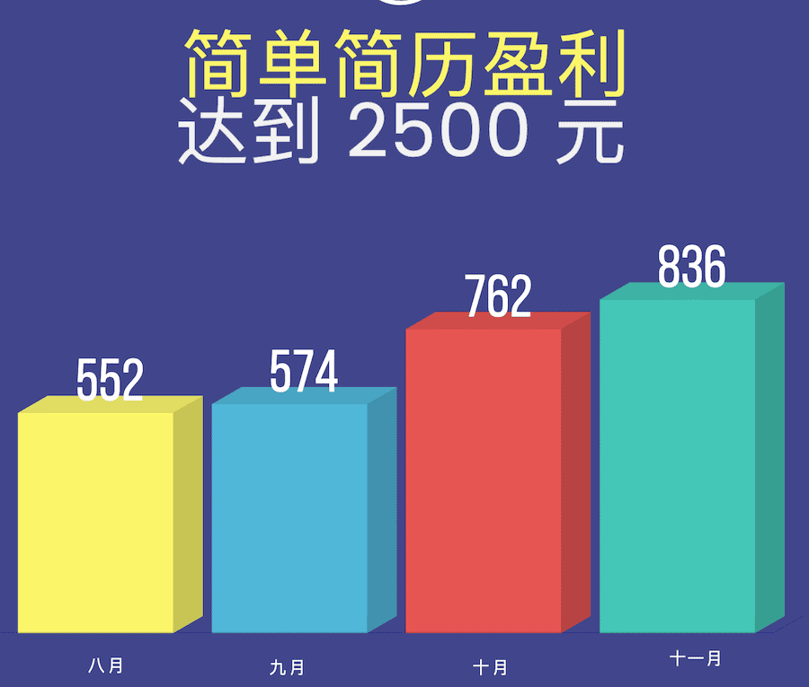
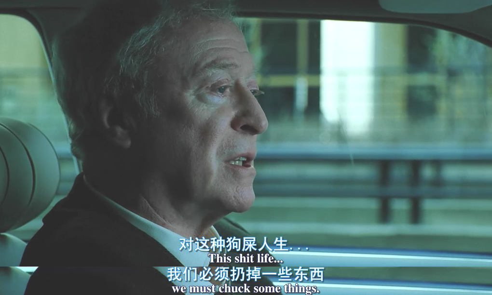

**[点击在 Youtube 查看视频版本](https://youtu.be/ShQNuuLqaRk)**

## 开始

大家好，我叫张轩，是一个自由职业的程序员，时间过的很快，我不上班已经 1000天了，其实不止，我是从 2019年 7 月 1 日开始自由职业的。这三年来整个计算机行业大环境是在走下坡路，996，内卷，人才过剩，裁员，35岁危机层出不穷。焦虑感不停袭击着我们脆弱的神经，所以我在这里给大家分享下自由职业的故事，也就是我亲身经历的程序员的 B 计划，另外一种生活方式。

## 做了些什么

言简意赅的来说，我这三年中做了三件事：

1 独立开发了简单简历，[https://easycv.cn](https://easycv.cn) 一个程序员的简历生成工具，这是我从最后一年才开始做的项目，花了大约半年完成开发。

2 在慕课网,  [http://www.imooc.com/u/6012904](http://www.imooc.com/u/6012904) 做讲师，卖课，这是贯穿 3 年的工作，也是我的主要收入来源。

3 经营个人品牌，在不同的平台收获粉丝，并且可以成为流量的来源。

## 为什么

开始的机缘很简单，我不想上班了，每天通勤让我忙碌又盲目，工作内容琐碎又没有意义，觉得对自己的提高不大。而我又不想找新的工作，我不喜欢刷题，这是一种无聊又没有成就感的过程，我也讨厌面试，我不是社恐，相反我还很喜欢和有意思的人交流，但是和面试官带着面具的虚伪谈话让我非常焦虑以及紧张。

我一开始没想着自由职业，而是打算给自己一个 gap year，看看不上班能不能生活下去，不行就再回去找工作，没想到这一下就过了 3 年，说明这是一种可持续的生活方式。

## 前提条件

开始之前我们先来谈谈前提条件，条件很简单，**就是钱**，如果你面临着很大的财务压力，比如你有市区的大房子需要 2 万的月供，几千的车贷，几个小孩在嗷嗷待哺。强烈建议不要开始，因为一开始收入肯定是很少的，这个问题会折磨的你焦头烂额，做很多错误的决定，你尝试逃离一种生活但会掉入一个更差的黑洞中，这就是得不偿失。

## 独立开发做产品

做一个有意思的产品一直是我的梦想，我相信也是很多程序员的梦想，我可以使用任何想用的技术栈，实现一些社会价值，帮助到一些人。从慕课网的学生中，发掘的灵感让我开发了简单简历 [https://easycv.cn](https://easycv.cn) 这个产品，是一款专注于程序员的简历生成工具，有一些独特的针对这个群体的特点。这个项目是我目前专注的事情，我将整个过程都当作一个实验，会记录整个的开发，宣传，数据，以及盈利的过程。

它的开发断断续续持续了半年，从 8 月 19 日上线到现在，是 3 个多月，我已经写了两篇长文/视频来记录整个流程。

* [我独立开发的产品是怎样获得最初的 300 个用户的？](https://vikingz.me/first-300-customers/)
* [我独立开发的产品是怎样赚到第一个 2000 元的？](https://vikingz.me/first-2000/)

简单简历目前有 **900** 人注册，创建了 **954** 封简历，盈利有 **2500** 元。

> 简单简历的盈利变化，具体过程请看上面对应的文章。

这是一个充满挑战，激动人心的过程，其实不仅仅是这个产品能赚多少钱，它还从全方面的提升了我自己:

第一是**技术成长**，这个项目技术上不是看起来那么简单，我提升了自己的全栈的代码水平，前后端都使用了 typescript，共享了一些数据结构和组件，并且未来准备实践一些微前端的改造，还有大幅提升了我 CI/CD 的实战水平，整个后端部署基于 Docker，阿里云 ACR以及 Github Actions。我做了比较多的 devops 的工作，用最小的成本让整个部署自动化起来。

同时除了代码，我还准备了非常多的文案以及物料，所有的简历范本，帮助文档，简历指南都是我一个人慢慢完成的。这些文字内容也从侧面让整个网站丰富和生动起来。

最重要的是我第一次开始了**市场推广**，程序员最不擅长的事情，怎样冷启动，怎样验证商业模式，哪个平台的流量最好。这些事情是 “纸上得来终觉浅，绝知此事要躬行”，只要完整的做一遍你才知道其中的奥秘。

所以欢迎大家持续关注我的作品，我会一直继续分享它的分享过程，也是我目前的热情动力所在。

## 卖课

当然如果考虑一个实际问题：钱，上面的 3000 元远远不够 3年的生活费，所以你必须要有一个稳定，持续的慢慢积累的收入来源。

知识付费在前几年一直都很火，同时我发现虽然我不是一个程序员大神，但是我在讲课上有一点天赋，可以将知识以深入浅出的方式讲出来。所以我想尝试一下前端视频课程。

一开始在自建平台和选择大平台上我犹豫了一下，后来我还是选择了比较大的平台 - 慕课网。因为卖课的目的是能快速的积累收入以及扩大知名度，自建平台要面对推广/视频存储成本/可持续性等多种问题，我见过很多自建平台慢慢的停更了。

我在上班的时候就出了第一个课程，卖的很一般，但是通过这个课程的经验，为未来的课程内容和讲法收获了很多经验。

做课设立了一个自己的标准，不贩卖焦虑，不打鸡血，就是讲技术。高质量的代码，高质量的视频质量（所有视频我都会精修一遍，剪掉没有录好的部分，不需要编辑去修改）。

三年来我断断续续的出品了 7 门课程。收获了挺多的好评，在这里我就不打广告了，品质还是有保证的，有兴趣的可以去看一下，[http://www.imooc.com/u/6012904](http://www.imooc.com/u/6012904),如果你学习 React 以及 Vue3，可以参考下。

对于收入来说，每个课程都会有一个平稳期，由刚开始上线的高峰到差不多每月都卖那么多，所以收入会慢慢的累积上涨。当然今年由于疫情和失业率上升，大家都没钱了，要比去年差一些。

之前有人留言和我说 **“你这卖课根本不可持续。”**

我想说：工作难道就是可持续的吗？现在上午去上班，下午就被裁员的情况已经屡见不鲜了。

而且一些课程是可以持续的，方法就是不断的迭代以及更新，和做项目一样，我其中的一门卖的不错的 vue3 的课程：[Vue3 + TS 仿知乎专栏企业级项目](https://coding.imooc.com/class/449.html)，已经根据 vue3 的发展更新过几版。还是能够有比较持续稳定的收入。

> vue3 课程的销售变化(份数)，可以观察到，经过不断更新以后，份数可以保持在一个相对稳定的水平。

最后如果你要选择知识付费，我建议你和大平台合作，虽然有一些限制，但是可以更快的获得曝光，收入。当收入还可以的时候，你就可以没有后顾之忧的做一些自己想做的事情。

## 个人品牌

最后来说说个人品牌，这是一个说烂了的话题，但是很重要，因为当今互联网的世界，有流量就有了所有，如果你要开始自由职业，建议一定要重视这方面的建设，虽然它不能很快的帮你变现，但是它是你连通你其他产品的一个重要渠道。所以你不管做什么自由职业，这块必须作为一个必要的补充，单单从钱的角度来讲，互联网的引流是非常贵的，如果有同学花钱请小有名气的博主写过推广就知道，所以如果你自己能给你的产品带来流量，那么无形中就产生了价值，赚到了实实在在的钱。

下面我分享一下我这三年收获的一些社交平台粉丝数，以及它们平台对应的导流效果，也就是包括算法自动推荐的效果。

* 蓝鸟 @vikingmute 12.6K **五星**，点击率很高。
* B 站 [https://space.bilibili.com/480241067](https://space.bilibili.com/480241067) 3400 **四星**，推荐算法强大。
* 油管 [https://www.youtube.com/channel/UCm5Z1WsCPhxl_NznRK0tvEw](https://www.youtube.com/channel/UCm5Z1WsCPhxl_NznRK0tvEw) 2700 **三星**，中规中矩，推荐也还是不错。
* 知乎 [https://www.zhihu.com/people/vikingmute](https://www.zhihu.com/people/vikingmute) 4714，**两星**，和粉丝数量没啥关系，全看投稿到问题的曝光度。
* 公众号：程序员的乌托邦 2500，**两星**，专业知识内容推荐很弱，聊胜于无。

那么怎样创建个人品牌，我在简单简历中写过一个指南，如果有需要可以看一下：[https://docs.easycv.cn/guide/branding.html](https://docs.easycv.cn/guide/branding.html)

简单总结几点就是：

1 定位自己擅长的领域（前端/后端/运维/杂谈/设计/区块链）

2 选择自己擅长的方式（文章/视频/播客）

3 持续分享有价值的内容，持续非常重要，不要三分钟热度，要把这件事本身当作有趣的事情，是一种展示自己的方式，不要把它当作限制自己的任务。

## 怎样坚持

世界上没有万能药，一个人自由职业看起来轻松，但是是非常考量内心强大的一个过程，会面对以下几个问题：

* 长时间的一个人，很容易陷入孤独感的包围中。
* 工作没有监督，很容易没法集中注意力导致效率低下，刷手机/打游戏/走神等等。
* 没有收入，做了很多产品但是没有获得盈利，孤芳自赏，对自信心的严重打击。

这些都是我遇到的困境和问题，对此我不断摸索的应对方式是：

* 保持规律，早点起床，打造专属的办公空间，每天像正式上班一样穿好社交的衣服工作，绝不穿睡衣，不洗脸不刷牙就开始。
* 建立项目里程碑和时间点，以敏捷开发形式开发项目，持续发布给自己带来归属感和成就感。
* 保持运动，运动分泌多巴胺，可以赶走挫败感和抑郁情绪。
* 建立个人品牌，扩大社交圈子，多交流。
* 先以赚钱为目的，最好先想办法快速的有稳定的收入，然后再开发试验自己的梦想的产品。
* 及时止损，设定时间期限，比如两年，如果发现这条道走不通，那么就重新回到公司中。

## 后记

这就是我自由职业3年来的一些经验，这个过程有好有坏，世界上没有完美的解决方案，但是追求新的生活方式应该是都每个人渴望的，如果你想开始程序员的自由职业的尝试，可以按照我的想法来实践，人的性格中有一个性格请摒弃：那就是患得患失，最后以我最喜欢的电影[《天气预报员》](https://movie.douban.com/subject/1309054/)的一句经典台词结尾，这部电影是尼古拉斯凯奇在 2005 年的电影，他扮演一个遇到中年危机的天气预报员，他老爸在劝他面对狗屎生活的时候说的一句话：

>"This shit life，we must chunk somethings"。

希望大家都能 chunk 掉那些生活中没用的东西。

