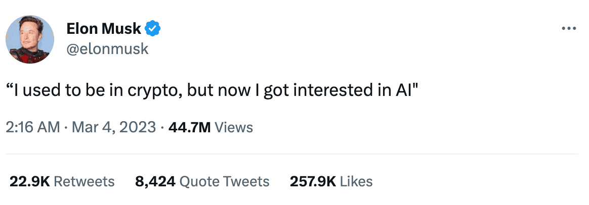

**[点击在 Youtube 查看视频版本](https://youtu.be/ooOJTBgSdeo)**

**[点击在 B站 查看视频版本](https://www.bilibili.com/video/BV1N54y1g792/)**

## 前言以及回顾

大家好，好久不见，我是简单简历，[https://easycv.cn](https://easycv.cn) 的创始人张轩，它是一个专注于互联网从业者的简历生成工具，我的小产品在二月份达到了一个新的小小的里程碑，月收入达到了**2000**元，准确数目是 **2106** 元。所以呢我想把这段时间内我的一些关于独立开发以及运营的小经验分享给大家。

我一直在记录产品的一些阶段性的进展，如果感兴趣，大家可以按时间线阅读或者观看以下的文章/视频：

* [我独立开发的产品是怎样获得最初的 300 个用户的？](https://vikingz.me/first-300-customers/)
* [我独立开发的产品是怎样赚到第一个 2000 元的？](https://vikingz.me/first-2000/)
* [不上班的1000天，程序员自由职业 B 计划 - 做什么/收入/经验教训](https://vikingz.me/1000-days/)

## 收入分析

下图是我二月份收入的变化图，单位是付款的笔数：

可以看到从总金额，笔数以及单价都有一定的上涨。

在经过比较稳定的发展时期以后，我的产品在过年那一段时间的 PV 和付款人数比较惨淡，不过我发现这好像是各种产品的常态，但是过完年后付款人数突然成上涨的趋势，从图中就可以看到，然后稳定在一个对应的数值，我认为有四个原因：

* 过完年上班是找工作的旺季，今年失业人数增多，使用上升。

* 用户的口口相传，我这两个月没有什么特别的推广也没有什么花哨的拉新技巧，但是从咨询的用户来看，有些人是被朋友推荐来的，留存率也高了一些。

* 搜索引擎带来的流量。

* 定价机制的修改。

后面这两点会在后面的内容中详细解释。

我这次的经验是：如果之前商业模式有过简单验证，那么剩下的就是坚持，不断的把产品做下去，根据用户需求持续迭代，不要特别急功近利，在这样的积累下，有时候会有一个突然的时刻出现一个小幅的提升，用国外的说法就是 **“aha moment”**。

## 别抱那么大的希望

这里想插一段内容，也想献给很多独立开发者：

年初的一篇文章对我触动特别大: I am done, I give up

[https://news.ycombinator.com/item?id=34103896](https://news.ycombinator.com/item?id=34103896)

我分享了以后，喜欢转发也特别多，看来很多人也是感同身受，说的是一个独立开发者失败的创业故事，作者连续创建了3个项目，然后都失败了，而且一点浪花都没有，最后还得了抑郁症。里面的评论也很精彩，大家可以好好看一下。

>But no matter what I did, I couldn't seem to get anywhere. My efforts were fruitless and I'm tired of trying. I barely had 20 followers, my substack and product blogs didn't get any signups, and while I did get a few upvotes (8) on Product Hunt once, I never had a paid customer.

上面是他非常惨的一段自述，最多20个粉丝，博客没人关注，产品就8个点赞，没有一个付费用户，肯定会有很多人感同身受，

我遇到一些程序员，由于是创业，对自己的产品期望太高，投入太大，甚至可以说是孤注一掷，以盈利为产品的唯一目的，当产品有一点不顺的地方就会陷入焦虑和迷茫中。

我认为你的第一个产品应该是 Side Project，有稳定的工作的时候创建，要以兴趣导向，把兴趣作为做产品的第一要素，这样能不能成功都不要有太高的期待，放平心态，在这个过程中最重要的是学习技术，产品的一系列经验，当你打开自己的项目，就像打开了自己最钟爱的游戏，每按下键盘，应该都是开心愉悦，充满期待的。

还有就是不要加太多的群，听太多别人成功的故事，比如群里说谁谁基于 ChatGPT 的项目一天又赚了多少钱。容易自怨自艾，迷失自己，打乱你的节奏。其实成功这种东西很大一部分因素来源于运气，没法复制别人的成功经验。找好自己的里程碑，不断迭代就好。

## 自然而然的搜索引擎流量

重新回到正题，在二月份我的一部分流量来自搜索引擎，大约十分之一，比之前增加的比较明显，我发现 google 和 bing 都收录了一些有一定热度的关键词，比如“高级前端开发工程师 简历”，“Web3 开发工程师简历” 等等。

> 在 google 搜索高级前端开发工程师 简历 排名第一

我的应用没有做任何的 SEO 优化，也没有尝试过竞价排名，我当时简单搜索过怎么优化 SEO，就添加了一些基本的 Meta 标签，其他方式后来觉得麻烦就放弃了。我能做的就是不停产出一些自认为优质的内容，从简历书写指南到范本再到整个过程分享，都是我一点点的完成的。现在的热潮都是 AI 生成，假如我**逆势而为**，所有内容都是真人生成的，变化多端的。就像现在大规模工厂生产的食品与手工古早食品一样，会有另外一种吸引力。

所以有时候是水到渠成的事情，这也是我做这个产品整个过程的简单哲学。

## 重新审视产品定位和定价机制

还有一个[收入增长](https://easycv.cn/pricing)的原因是我想清楚了自己产品的定位：一开始我非常刻板的将简历生成工具想象成了一个需要长期使用的订阅产品，为什么会这么想，没有原因，纯粹就是刻板的复制大众所知的订阅付费模式，所以在定价的第二档是一个年付用户。

但是后来我了解到了这个产品其实是一个完全工具类的产品，就和扫描文件类似，只有有特定的需求的时候才会短时间使用，用完以后就算完了，属于一锤子买卖。

找工作也是一样，只不过它的周期有可能更长一点，所以我去掉了年付用户，而添加了季付用户（收费20元，优惠三分之一），因为一个季度可以完美的覆盖一个招聘周期。

> 新添加的季付模式

这个定价的改变非常有效，季付用户达到了总付费用户的**三分之一**，远远大于寥寥无几的年付用户。所以我的产品从一个伪订阅类的产品转化成了一个工具类的产品。这虽然是一个小小的变化，但是对我的思考模式产生了深远的影响。产品的模式不是拷贝过来就能用的，就像别人的成功不能拷贝一样。

## 持续曝光

这个点我已经说了多次了，不过这次我转变了一下机制，我发现最大的流量池以及是最快成长的观众来自于蓝鸟，我就为自己定了一个计划，每天更新一篇，不需要和我的产品相关，分享工作中遇到的优质资源。每篇阅读量都很可观（大约4，5万）这也让我的粉丝数上升的非常明显，为了监督自己，我下载了一个类似 Github Commit 的网格工具。用可视化的方式记录自己，人都是有仪式感的动物，使用这类的工具可以更好的帮助你坚持对应的习惯。

## Dont't believe the hype

最后分享一首来自 Public Enemy 的老歌作为结尾，这首歌有着过耳不忘的前奏，以及深刻的歌词，我很喜欢，尤其和其他大金链子泡妞挣大钱的选手相比，他们的说唱在歌词上有很强的造诣。

> 这首歌来自专辑 It Takes A Nation Of Millions To Hold Us Back

[Urban Dictionary](https://www.urbandictionary.com/define.php?term=Don%27t%20believe%20the%20hype) 这样描述这首歌的中心思想：

>“Ignore the media, marketing, buzz, or rumors around a story, object or person -- it's nothing special. “

意思就是不要被媒体，市场包装的看起来非常火热的领域或者个人蒙蔽双眼，要有自己的判断。

我最后想表达的是：现在是个信息爆炸的时代，每天有太多新名词冲击着大家的鼓膜，每个人都有 FOMO 的情绪，关注无数社交媒体账户，加无数的群，参加各种课程，只怕有什么新东西自己不了解，就会被时代抛弃。

前一阵 ChatGPT 比较火，对独立开发届也引起了很大的震动，所有人都在疯狂讨论，我看到很多开发者的思路其实都是围绕着它来做产品来赚钱，算命，写作，问答等等。但是这样做，第一会遇到非常多的竞争，二是你不再驱动产品，这个工具会变成你的主人，去驱使你，你产品的思路都一直迎合着它，所以我认为做产品还是不要盲从，不要随波逐流，要从切身的需求出发，而工具就让它做个工具，让它作为辅助你产品的帮手而已。

马斯克前几天发的一个推，很能说明这个问题：

>“I used to be in crypto, but now I got interested in AI"

当父母都在谈论 AI 以及 ChatGPT 的时候，也许我们就该想想另辟蹊径，而是不要和其他人一样打的头破血流。

