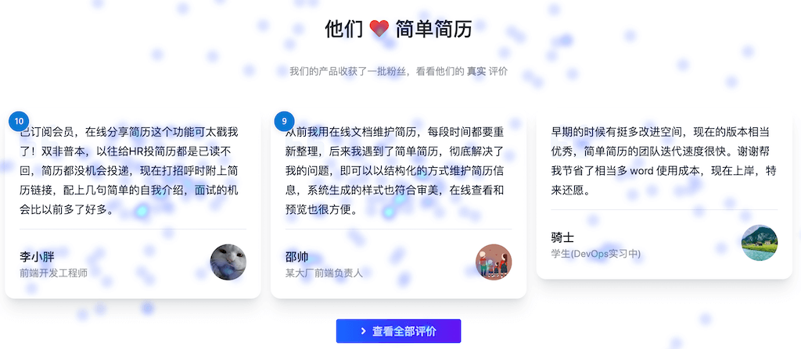
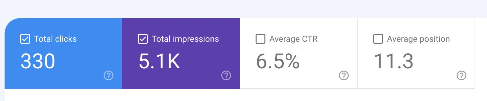

**[点击在 Youtube 查看视频版本](https://youtu.be/Riaa8g-InZE)**

**[点击在 B站 查看视频版本](https://www.bilibili.com/video/BV1uN411Y7Bu/)**

## 前言以及回顾

大家好，好久不见，我是[简单简历](https://easycv.cn)的创始人张轩，它是一个专注于互联网从业者的简历生成工具，我的小产品在六月份达到了一个新的小里程碑，月收入达到了 3000元，上一次的里程碑是二月份的收入两千元，所以从 2000 - 3000 用了四个月。所以呢我想把这段时间内我的一些关于独立开发以及运营的小经验分享给大家。

我一直在记录产品的一些阶段性的进展，如果感兴趣，大家可以按时间线阅读或者观看以下的文章/视频：

* [我独立开发的产品是怎样获得最初的 300 个用户的？](https://vikingz.me/first-300-customers/)
* [我独立开发的产品是怎样赚到第一个 2000 元的？](https://vikingz.me/first-2000/)
* [不上班的1000天，程序员自由职业 B 计划 - 做什么/收入/经验教训](https://vikingz.me/1000-days/)
* [小小里程碑，独立开发的作品简单简历月收入达到2000元](https://vikingz.me/2000mrr/)

同时我从现在开始会加大拍视频的频率，以前完全凭兴趣，更新很飘忽，这次我会将它作为个人品牌的重要一部分，会经常更新，所以我的希望大家可以关注我以及我的频道。

## 数据分析

直接看图：

> 每月销售金额变化图

> 每月销售订单数变化图

会发现：从二月份到达 2000 元以后，三月份维持了继续的上涨，订单笔数继续上升，从 134笔 到  143笔，收入达到了 2384 元。

两个关键的因素是：

* 关于二月份的视频和文章吸引来了很多的流量
* 3月份是找工作的旺季

但 4/5月的发展并没有突飞猛进，4 月份甚至还出现了倒退 - 99 笔（1408元）。

在五月份到六月份又重新回到了上升的趋势：

* 五月 150 笔 （2100元）
* 六月 160 笔 （3012元，订单没有增加太多，仰仗这个月好几个终生会员）

总算在 6 月份创下了新纪录，达成一个小里程碑。

应用在发展到一定的阶段，出现发展变缓甚至减少，无法大幅增长的是一个非常常见的情况，我见过很多独立开发者的谈论过这个问题，我解决这个问题的方式就是心态，继续按照原来的步骤进行迭代，继续按照之前的方式进行推广和分享，保持一颗佛系的心态
那么这两个月上升期我对网站有哪些调整，并且有哪些 “Aha moments”呢？ 

## 用户评价

我的市场和运营知识一直都是随着产品的发展来进行学习的，所以说就是边学边做。在上线以后的一段时间后，用户对我的产品积累了一系列评价。在我的认知中，用户都是沉默的，不太轻易回去评价产品，但是没想到，当你的产品真的解决问题的时候，用户会通过各种方式来给你反馈，即便入口隐藏的很深。他们通过邮件/私信/发推/留言各种方式发来评价或者意见，让我很感到惊讶。

> 早期的时候有挺多改进空间，现在的版本相当优秀，简单简历的团队迭代速度很快。谢谢帮我节省了相当多 word 使用成本，现在上岸，特来还愿。 
>
> 一位用户在用户反馈问卷中的评价

用户给产品的正反馈太重要了。他们会极大的增强你做产品的信心。

那么我自然想到要将这些用户评价放到首页去，因为真实的评价是产品最重要的背书，是非常重要的资源，因为这种用户评价在国外称之为*testimonial*，那么放在什么位置呢？

作为一个前端工程师，我平时最喜欢的就是研究不同网站的首页和模版，我发现他们都会放在一个首页靠下的位置，我喜欢的两个独立开发产品：
* [https://www.bannerbear.com/](https://www.bannerbear.com/) 
* [https://canny.io/](https://canny.io/) 

都放在了下面，

所以一开始我就人云亦云的放在了那里。

## 数据分析

用户评价上线以后，我老婆作为我的产品经理，就提出这个位置不好，要翻一屏才能看到，应该将评价放到上面，比如 CTA 的下面。而我坚持认为“这是国外网站的专业做法”。

那么谁的提议好呢？那就让数据来说话。那么我就想到了A/B 测试，不需要什么特别复杂的策略，只要有不同的热力图就好，所以我后来就找到了微软的一款特别好的开源免费服务：[Clarity](https://clarity.microsoft.com/)，我在之前的文章 [立省5000元，独立开发简单简历中使用的免费工具大曝光](https://vikingz.me/free-tools/) 中也介绍过，这里就不多讲了。

我选取了两个工作日，各自选择不同的放置位置，来看点击率和效果。

结果出乎意料，将用户评价放在上面从各个维度完胜放到下面，点击率，点击次数付款情况都有提升。

> 从图中能够看出，放在上面的位置点击率大大提升

后面我又再接再厉，搜集所有的用户评价，单独做了一个页面。

这件事情对我影响挺大的：

* 做事情**不能教条主义**，我很多时候就是照搬国外的一些经验，从最开始的定价方式，到这次的用户评价，以为就是对的，其实很多情况下，国内的环境和国外大相径庭，要通过实践找到适合自己的最佳方式。
* 以解决实际问题为主，不要空谈，用户评价这次实践，完美的完成了 提出问题 - 寻找解决方案 - 解决问题 的闭环。我想起原来在公司，很多时候为了完成 KPI，弄了一大堆非常相近的 A/B test，最后的数据也毫无意义。自己的产品发展一定要**贯彻实用主义的思想**。
* 题外话：一定要将**用户评价放到首页显眼的地方**，真的有用，并且要留下用户可以留言的入口，初期简单的放一个调查问卷也是完全可以的。

## 书上的方法到底有用吗？推出返利计划

我喜欢阅读关于独立开发的各种图书，之前的一些图书推荐获得了非常多人的喜欢。

在读的过程中，我总在思考一个问题：**这个方法究竟有用吗？** 我看了这么多书，了解了这么多方法论，那么它们是不是只能留在我的脑子里作为谈资，那么对于它是否真的对我的产品有帮助那么只有亲自做一做才知道。我们有时候开发很多功能，其实都是自己脑子里的幻想和一厢情愿，幻想的很美好，用户会一拥而上，但是其实开发出来发现他们并不是特别买账。

于是在六月份，我给网站添加了一个新的功能，这是我第一次完全拷贝书本里面的实践，来自一本已经烂大街的书[《增长黑客》](https://book.douban.com/subject/27593848/)，这本书评价很高，但是在我看来其实也就一般。

这个功能就是*邀请返利计划*，书里面对这个功能大书特书，描述了 Dropbox 使用邀请以后，用户在 15 个月内增长了 3900%。同时也说这是非常经典的方法论：非常多公司都在使用的增长方式。

所以我也就照猫画虎的上线了这个功能:[推荐奖励计划](https://easycv.cn/referral)，看起来挺诱人：

> **“每当你使用你的专属链接邀请一位新用户注册，被邀请者将获得价值 5 元的代金券， 可以在我们的平台上自由使用。如果他成功的购买会员，你将获得20%的金额作为代金券奖励”。**

这样做也是到底要看看一些看起来被奉为经典的方法论是否能够直接照搬到应用中获得对应的效果，我说了，我的网站本身就是实验的一部分，在创造中学习并且验证是我最初的目的。

目前从上线的半个月来看，效果一般，虽然我在首页添加了闪亮的按钮，但是其实点击率并不是很高，当然任何实验都是要给它一个时间，在足够长的维度才能看出结果，整个过程才是未知的，我们可以学习进步的最好过程。未来我会更新关于这个功能的一些数据。

## 最后：Aha Moments

快速的分享一下这段时间让我很开心的高光时刻，记录下这些小小的成就很重要，它会激励你将产品继续做下去：

1  一位同学使用简单简历成功找到新工作，并且涨薪 **40 %**，其实这样的反馈还有好几个，通过邮件/评价/用户反馈系统。

2 有用户在 v2ex 分享了一些自己的在线简历，带来了可观的流量。

3 “简历”搜索词在 google 排名新高，来到了第 **十一** 位。

4 用户在 7 月 4 日达到 **4000** 人。

好，这就是我这次达到这次里程碑的经验和收获了，我会一直记录独立开发以及我的产品简历简历的发展过程，欢迎大家持续关注。

