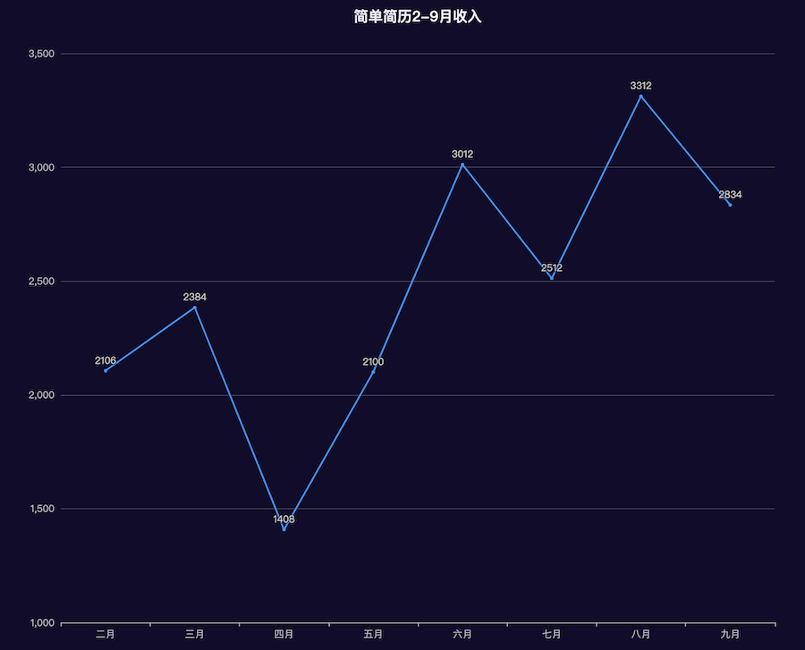
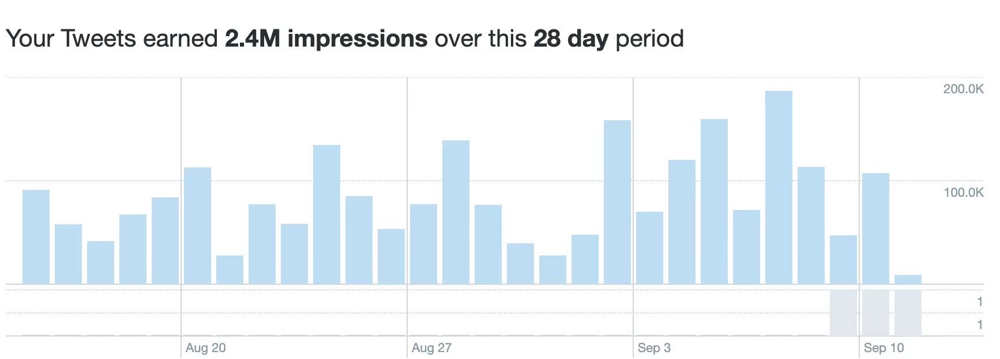
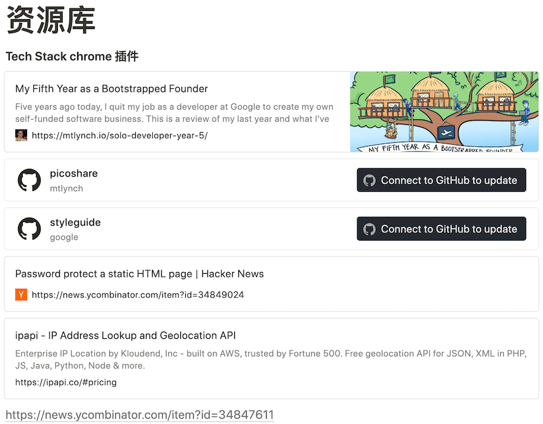

**[点击在 Youtube 查看视频版本](https://youtu.be/eqrP1HIci1g)**

**[点击在 B站 查看视频版本](https://www.bilibili.com/video/BV1kj411e7xP/)**

## 开始

大家好，我叫张轩，作为一名程序员，我做自由职业已经四年了，这四年我基本确定了人生的整体规划。我也一直在记录自己的经历，写了很多篇文章，和上班相比，这四年是我过的最充实，成长最快的四年，一年前我曾经写过不上班 1000 天，受到了一些朋友的喜欢，现在一年过去了，每一年我都会定期回顾一下这一年中我的成长，给大家从几个维度来分享一下新的感受。

## 推荐阅读

如果大家更想了解我开始自由职业的前因后果，怎样开始，注意事项，前三年的心路历程大家可以了解一下去年写的一篇 [https://vikingz.me/1000-days/](https://vikingz.me/1000-days/)，它更像是一个我自由职业的技术文档。而这一篇我专注于这一年新的见解和经历。

## 做了什么/收入来源

重申一下目前我的收入来源以及新的变化：

1 独立开发的项目：简单简历，[https://easycv.cn](https://easycv.cn) 一个程序员的简历生成工具，经过一年的发展，它的发展速度令我惊讶的，从一个实验变成了我收入的一部分。

2 在慕课网,  [http://www.imooc.com/u/6012904](http://www.imooc.com/u/6012904) 做讲师，卖课，这一年从卖课能明显感觉到计算机行业的下行，我升级了老课，出品了一门新课，我现在将更多精力从录课更多的转移到其他方向，每月的收入基本稳定。

3 经营个人品牌，在不同平台收获粉丝并且获利，今年是我粉丝增长挺快的一年，带来的流量也很不错。

4 接广告，和个人品牌相辅相成，由于流量今年开始我也接到了一些广告。

## 自由职业的热度

首先 2023 年是特殊的一年，大家应该都能感觉到经济下行的氛围，尤其是计算机行业，裁员层出不穷，很多人没有了工作，所以自由职业，独立开发的话题越来越火，很多人都在研究在经济情况很差的情况下，有什么方式是否多增加一份或者几份收入来源，做到未雨绸缪，以免未来失业发生的时候一下就抓瞎。但是请大家记住，从上班之外的途径获取收入不是一件容易的事情，所以我的这些文章就是分享自己自由职业的经历和感想，我从来不鼓励任何人放弃目前的工作，不切实际，人云亦云的去做自由职业，如果要做，必须要经过深思熟虑，看看是否达到一些基本的条件，比如是否有比较大的经济压力。**在互联网时代，不要随波逐流，一定不要做提线木偶，被无形的推荐流量随意摆弄，在任何一个时代，有独立思考的能力都是难能可贵的。**

## 自由的价值

**独立开发的第一要务永远都不是赚钱**，99%的独立开发者都没法赚上班那么多的钱，如果你一开始就有暴富的念头，那你要三思一下是否适合，自由职业最重要的价值就是**自由**，每天都不用定点上班，睡到自然醒是千金难换的体验，试想上海夏天40度通勤，不管是开车堵到死，还是地铁挤的和罐头一样，还有冬天10度起床都是非常痛苦的事情，不仅在体力上是一种折磨，更重要的是精神层面的摧残。而自由职业可以相对拥抱自由，可以随时暂停自己的工作，如果今天状态不好，就可以休息一天。也可以享受错峰旅游，看电影等等福利。所以可以这样认为，自由也是一种宝贵的财富，如果你可以随意享受支配自由的时间，那么从某种意义来说你也是在赚钱。

> 耳熟能详的电影《勇敢的心》当中最出名的台词

接下来我会详细说明一下：

## 简单简历的发展

做产品是我梦寐以求的，整个过程对我都是完全未知的，充满魅力，了解我的朋友都知道，我一直在记录简单简历的发展，已经写了很多关于它里程碑的文章，到现在上线大约一年，它发展的还不错，超过了我的预期，目前的总用户数是 **6500** 人，付费比大约是 **8.5%**，也收获了不少终身用户，完全出乎我的预料，收入在逐渐上涨，请看下面的月收入图：

> 简单简历的2-9月销售变化

它实现了一些里程碑，每个小成功都历历在目，最初 300 用户 - 第一个 2000 元 - 月收入 2000 元 - 月收入 3000 元。

* [我独立开发的产品是怎样获得最初的 300 个用户的？](https://vikingz.me/first-300-customers/)
* [我独立开发的产品是怎样赚到第一个 2000 元的？](https://vikingz.me/first-2000/)
* [小小里程碑，独立开发的作品简单简历月收入达到2000元](https://vikingz.me/2000mrr/)
* [新的里程碑 🎉 独立开发的作品简单简历月收入达到3000元](https://vikingz.me/3000mrr/)

我对产品的经验还是老生常谈，但是是很好的方法论：寻找真实的需求 - 找到盈利的点 - 验证是否可行（付费比）- 持续宣传/迭代/实验。

我在之后会做这个产品的英文版出海，对于这次全新的旅途，应该也是充满未知和乐趣的，到时候会和大家分享一下。

## 个人品牌以及广告

这个时代流量为王，所以我认为个人品牌是非常重要的，它目前成了我的中枢神经，它属于万金油，可以帮你扩展多条新的渠道。

拿我来说，我的蓝鸟和 B 站在去年增长迅猛，相比视频来说，我更喜欢文字，所以做的不好的地方就是视频更新的还是不够频繁，也许是我对视频的要求太高，必须是优质的话题和言之有物的内容，每月都能做到 200 多万的曝光，是一个很不错的数据。

> 28 天的流量达到 240 万

这些流量给我带来了多个好处
* 导流，简单简历在初期一大部分流量都是从这里来的，成功完成了最初的过渡。
* 流量本身的盈利，当你有一定流量的时候，就可以拿到平台的分成了。
* 广告，今年的一大变化是我接到广告了，就是因为粉丝的增长，有文字版本也有视频，在接广告之前，我会很好的甄别广告，真的是优质以及和程序员相关的广告才会接。

所以一定不要闷头做产品，甚至可以在产品诞生之前就可以开始想想怎样去做，我最简单的经验就是**坚持分享**，虽然简单，但是很多人都没法坚持，三分钟热度，我给自己定的任务就是每天都要发一条比较优质的内容，已经坚持了至少一年，每天九点会花十五分钟左右搜集/消化/撰写，并且形成一个自己的资源库，在之后可以随时抽取出来发布，这样做挺起来特别功利，所以要看你怎么定位这些平台，如果你把它当作闲聊分享生活的平台大可不必这样，但是假如你想把它当作一个正经的流量平台来做的话，那就要坚持。

> 我的资源库，积累了很多好的分享资源

我一般会选择以下方向的内容，事实证明，这些类型的内容也是更容易让大家收藏或者产生共鸣：

* 独立开发的成长和经验
* 平时编程的技巧，工具以及最佳实践
* 开源库/工具/计算机书籍推荐
* 前端开发业界趋势以及新闻

## 卖课 / 学会 Pivot 

进入 2023 年以来，我在卖课上投入的时间在越来越减少，只出了一门新课，升级了两门老课，大约占我工作时间的 30 %。原因是受经济形势的影响，互联网裁员加上不景气，从课的销售水平上就能看出来，这就是 *“春江水暖鸭先知”*，大家没有原来那样有钱了，对于稍微贵点的，超过几百的东西，都会比原来考虑的更多，现在卖课的收入基本趋于稳定，每月有差不多的收入，但是单位时间的投入产出比已经不能和 2020 - 2021 最鼎盛的时期相比。

消费降级也越来越提及，所以拼多多的财报数据会那么好，股价也增长的很不错。从另外一个侧面能反映出我的小产品发展的不错，第一是大家都有求职的需求，第二是它的定价真的很便宜，一个月五块十块的，还是能够消费的起。

所以你需要根据当前的形势动态调整你的个人战略，这在英文中有个词称之为 *Pivot*，就是转向的意思，不要花最多的时间在当前一个发展正在下行的行业里，及时调整你的侧重点，同时注意，不要把鸡蛋放在一个篮子里，最好要发展多个收入来源。

## 模糊定位，开拓多项业务，做 “一人公司”

这一点也和上一个观点相辅相成，我在 4 年自由职业的生涯中，发现一个最普遍现象就是 “独立开发者” 喜欢创造一种苦行僧式的仪式感，一种特有的价值观，认为只有自己做出一个很棒的产品，通过这个产品有机增长赚到钱才能匹配这个头衔。我最早卖课的时候，还没有独立的产品，也被一些人嘲讽过，你这卖课不是什么独立开发。

**如果要延长你独立开发的时间，不要永远狭隘的给自己定位一个角色，只写代码，啥有意思都可以做做，不如叫自由职业或者一人公司，设法扩大自己的收入来源，做产品，卖课，拍视频，接广告都可以试试，赚钱嘛，不寒碜，但是要有一个底线，一定不要赚不道德的钱。**

最近也有很多独立开发者在晒自己的收入或者心路历程用来营销自己，我觉得这很好，我也是这么做的，因为独立开发本来就是一人公司，这就是打广告的另外一种形式，有的人在社交媒体只为闲聊，有的人为了扩大影响力，各取所需，并且这广告还能让人学到一些有趣的知识，帮助别人，利人利己。

## 后记

这是我四年来自由职业的一些感想，整体来说还是比上班更舒服，一开始我只是试试看，现在相信它是我未来生活的模式了，追求新的生活方式应该是都每个人渴望的，尤其是对自由的渴求，可以开启新的生活方式的大门。我还会在这条路上尝试更多新的东西，到时候可以和大家分享一些新的见解。

