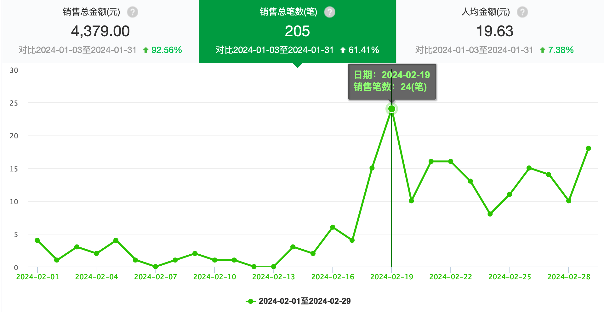
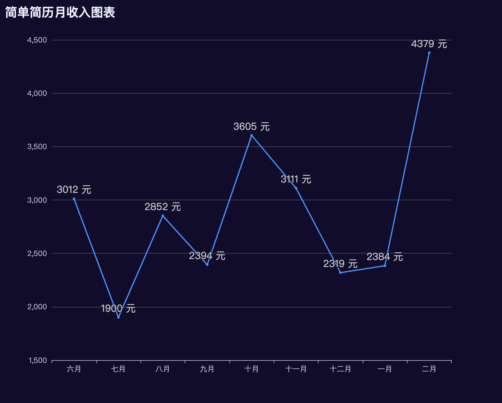
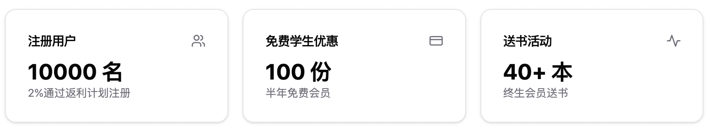
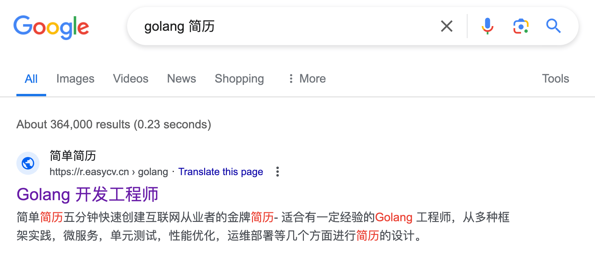

**[点击在 Youtube 查看视频版本](https://youtu.be/SVS6meW5_WE)**

**[点击在 B站 查看视频版本](https://www.bilibili.com/video/BV121421m7MT/)**

## 前言以及回顾

大家好，好久不见，我是[简单简历](https://easycv.cn)的创始人张轩，它是一个专注于互联网从业者的简历生成工具，我的小产品在二月份达到了一个新的小里程碑，月收入达到了 4000 元，距离上一次 3000元已经过了将近半年，期间收入不断起伏，最终达到新的里程碑，所以呢我想把这段时间内我的一些关于独立开发以及运营的小经验分享给大家。

我一直在记录产品的一些阶段性的进展，如果感兴趣，大家可以按时间线阅读或者观看以下的文章/视频：

* [我独立开发的产品是怎样获得最初的 300 个用户的？](https://vikingz.me/first-300-customers/)
* [我独立开发的产品是怎样赚到第一个 2000 元的？](https://vikingz.me/first-2000/)
* [不上班的1000天，程序员自由职业 B 计划 - 做什么/收入/经验教训](https://vikingz.me/1000-days/)
* [小小里程碑，独立开发的作品简单简历月收入达到2000元](https://vikingz.me/2000mrr/)
* [小小里程碑，独立开发的作品简单简历月收入达到3000元](https://vikingz.me/3000mrr/)
* [程序员自由职业/独立开发的第四年 - 做什么/收入/经验教训](https://vikingz.me/4-years/)

## 数据分析

直接看图：

> 2月销售比数变化图

> 每月销售金额变化图

在去年 6 月份到达 3000元 之后，产品并没有预料的收入继续上升，始终在 3000 左右徘徊，长达半年，在二月份上半月的过年的时候，和其他独立开发者产品的反馈一样，数据非常惨淡，我也没想过这个月能有任何的突破。但是在年后的上班的前几天，数据反弹的让我有点惊异，达到 **24** 笔，是单日比数最多，我还以为是偶然现象，但是接下来几天的极速上升都没有停止，有一天甚至创下了单日收入最高。所以有时候开发运营一个产品，这种未知会让你觉得非常有趣，是一种和上班那种可预见性无法比拟的快乐。

经过这一年多的发展才知道，我明白了一个非常简单的道理：产品是一个完全 **seasonal trend 季节性趋势** 的工具，和求职周期有着非常强烈的关系，开学开工都会迎来一波小的找工作高潮，所以金三银四是我收入的高点。接下来的发展也完全证实了我当时的猜想，2月靠着下半个月的收入，竟然创下了最高，突破 4000 元，来到了 **4379** 元。

所以一个很好的销售方式就是，可以通过这些趋势安排活动等等来促进销售，由于最近比较忙，我准备之后试试这个措施。

## 里程碑

在这半年来，简单简历迎来了几个里程碑，在我看来非常有意义:

> 最近的里程碑

**10000 用户**

产品迎来了 10000 名注册用户，用了一年半的时间，而且大约**百分之二**是通过之前实验推出的返利计划注册的，也从侧面证明了这种传统的引流方式的实用性。

**送出 100 份学生免费优惠**

产品创建的时候的宗旨就是要为学生送福利，到现在已经累计给 100 名学生送上了免费的半年会员，有很多学生还特意写来了感谢信，在这我看来是特别有成就感的事情，也希望能通过自己的产品能帮助一些人。

**送书计划**

去年12月我做了产品的第一次活动，给终生会员免费送书，我想从另外一个层面去回馈产品的终身会员，能用这种方式来支持一个独立开发的产品，感觉有好大一部分都是去支持我个人的，所以我想对这些朋友表示一些实际的谢意。 **[关于送书活动的详情](https://docs.easycv.cn/blog/new-year-event.html)**

## SEO SEO SEO！

和最初不断的在不同平台发帖不同，为了检验自然增长的方式，我好几个月几乎都停止在不同平台继续宣传关于产品的点滴，只是发表一些重大更新和活动，但是非常可喜的是，在过年以后，Google 的关键字给我带来了越来越多的惊喜，其中的几个简历范本已经在多个关键字排名非常靠前，给我带来了不少的浏览。

> Golang 关键字搜索排名第一

* Golang 开发工程师 https://r.easycv.cn/golang 排名 *“Golang 简历”* 第一。
* 高级前端开发工程师 https://r.easycv.cn/seniorFE 排名 *“前端简历” “前端开发简历” “高级前端简历”* 前五。
* React 开发工程师 https://r.easycv.cn/react 排名 *“React 简历”* 第二。
* Vue 开发工程师 https://r.easycv.cn/vue 排名 *“Vue 简历”* 第二。

我对 SEO 几乎没有任何的经验，我在这一年中做的就是不断添加和更新简历范本，没有用 AI，尤其是前端方向的几个简历，几乎都是手工一个个字写出来的，采用的是最新最全的技术栈，和其他那种机器生成的简历能一下感受到不同，前一年在不同平台发帖宣传简单简历获得 backlinks。我没有用任何的关键字分析平台，所做的就是尽量写优质的内容，然后慢慢等着它发酵，也没想到这几个关键字居然都能排到前面去。

## Do what you love

我做这个产品一开始就有一个特别幼稚的想法：

> 做我喜欢的事情，做我梦想里的产品

所以一些要点是我不能妥协的：

* 我想做一个**基于 Web**的产品，我不喜欢手机系统的封闭，而且 Web 任何平台都能访问，不需要安装，不需要平台的抽成。
* 做我技术的试验田，我对于新技术有追求，想在我的产品上实验最新的技术以及框架，[levelsio](https://twitter.com/levelsio) 那种技术无用论，所有项目都是 PHP + jQuery 一把梭的方式是不被我接受的，当然这里不是对 PHP/jQuery 有任何的成见，它们现在也是非常出色的语言和工具，我所诟病他还在使用很久以前的项目书写方式。写出优美的代码，实现复杂的功能，是盈利之外，产品给我带来快乐的一大源泉。
* 希望我的产品可以从某种程度上帮助一些人，从结果上来看，不管是学生免费计划，还是有的用户使用产品找到新的工作发来的感谢信，都能让我开心很久，这种发自内心的成就感是无与伦比的快乐。
* 保持自己的节奏，网络上的声音太多了，当你受到一定关注的时候，会有各种各样不同的声音出来，有一些看似权威的人士会建议你做这这那，比如项目要优先出海啊，要怎样搞 SEO 啊，我一开始也是很没有安全感，每天都会思考我该不该做这些，会感觉到很焦虑，那种最初始的快乐都没有了，后来我发现他们的一些声音也并不适合你的产品，**记住这是自己的产品**，一个很重要的经验就是**不要笃信所谓的权威**，这是你自己的产品，你尽可能做让你自己开心以及有成就感的内容，别被一些建议牵着鼻子走。

到现在，我感觉我渐渐的可以实现这个目标，每次打开项目写代码的时候，都有一阵怪异的满足感在我心中升起。

## 结尾

最后说一个题外话，在我开始自由职业的时候，我也建过一个所谓的独立开发群，由于最初的那篇文章很火，200人几乎是瞬间就加满了，极大的满足了我的自尊心，同时我也想找到志同道合的朋友，也努力去加一些群甚至是付费群，加群的初衷都是FOMO（Fear of missing out），害怕错过任何的机会。

随着时间的推移，我会慢慢发现大多数群其实没有给我任何的帮助，大多数时间都是群里在吹水，并没有太多的干货，好多群留给你的就是 99 条未读消息的符号，除了浪费时间外并没有学到太多的知识，所以我退出了大多数的群，Mute 了剩下的群，也不打算再建群再让陌生人加群，也不在意错过每天爆炸一样的信息，刷社交媒体的时间大大减少，当然，这不代表我停止分享，我更喜欢经过深思熟虑，写有条理的文字的形式继续分享，对于产品发展我的心态也平稳了很多，不再每天急躁的关注各种数据，怎样想方设法的去宣传，而是眼光放长远一点，有的时候要一个产品确实要经过一定时间的积淀以后才能有机的成长。

如果你也感觉到加了那么多的群，看了那么多消息还是感觉焦虑万分，不妨也可以试试我的方式。

好，这就是我这次达到这次里程碑的经验和收获了，我会一直记录独立开发以及我的产品简单简历的发展过程，欢迎大家持续关注。
