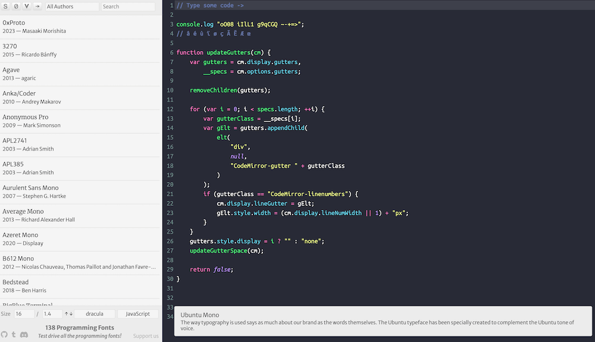

**[点击在 Youtube 查看视频版本](https://youtu.be/ww2mIn5OsEI)**

**[点击在 B站 查看视频版本](https://www.bilibili.com/video/BV1ww411h7iD/)**

## 开始

字体/终端/主题是程序员最喜欢讨论的几大话题，程序员在对某些和我们朝夕相处的工具都在追求高颜值，前几天我分享编程字体的帖子受到了很多朋友的喜欢，讨论的热度非常高，整个的浏览量达到了几百万，在这里我就做一个总结的文章视频，讨论编程字体的一些周边科普，同时来看看现在最流行最受欢迎的字体都有哪些？文字版本的链接在视频下方，大家不要忘记点击同时观看，因为有很多链接，视频不好体现出来。

> 我发的几个帖子的大体数据，选取浏览最高的三个，所有帖子加起来有 200 万多

## 等宽字体

首先先科普几个小概念，算是新手向的内容，如果大家都已经很了解了，可以直接跳过，看后面的字体总结和推荐就好了。

编程字体一般都会使用 **等宽字体（monospaced）** （也称为固定宽度或等间距字体）是指每个字符都占据相同的水平空间，在一般字体中，字符的宽度是不一样的，因为它们书写的原因，比如 w 就会很宽，而 i 就会比较窄，假如用在编程上就会造成问题。

等宽字体使得代码中的对齐和缩进更加容易，在某些情况下，需要垂直对齐代码的不同行，等宽字体使得代码在垂直方向上更容易对齐，从而提高可读性，最后也有助于防止一些字符在对齐时产生视觉上的偏差。

## 编程字体大集合

个人喜好是一个非常私人的东西，在这里我先给大家推荐一个编程字体大集合的网站，集合了目前市面上所有流行的**138**种编程字体，同时可以预览，筛选，还可以切换主题。是我非常喜欢的一个资源，大家可以在里面先浏览一下，

[https://www.programmingfonts.org/](https://www.programmingfonts.org/)

## 编程字体的特殊设计

在 [https://www.programmingfonts.org/](https://www.programmingfonts.org/) 中有几个特殊的筛选项，就是针对编程字体的特殊设计：

> 编程字体的几个特点

### Zero Style

0 和 O 很容易混淆，所以 0 会以特殊的形式进行设计，在 0 的圆圈中间一般会添加对应的修饰。一般是一条斜线或者一个点。

### 点阵字体

这里有一阵非常特殊的展示风格，称之为点阵（Bitmap）字体，也就是像素风，是早期计算机图形用户界面（GUI）使用的字体，同时现在也可以用于嵌入式系统、小型显示设备以及一些需要在低分辨率屏幕上显示的环境中。在视觉上呈现出复古、游戏风格或像素艺术的感觉。

### Ligature
Ligature（连字）是一种字形的排印风格，它将两个或多个字符组合成一个单一的字符形状。Ligature 在编程字体中的使用旨在提高可读性和美学，组合成更具视觉吸引力的形状，以改善代码的外观。

在代码中使用 ligatures 可以使代码更富有表现力，但也要注意确保团队成员都理解这些 ligatures，以避免理解差异。

## Nerd Fonts
说完了编程字体的一些特性，我们在来介绍一下字体的增强。那就是 Nerd Fonts 系列。
Nerd Fonts 是一系列的开源字体，旨在提供一套包含各种编程图标和符号的字体，以增强编程体验。这些字体包括许多常用的图标，如文件夹、文件类型、箭头、分支图标等，以及其他一些用于编程和终端环境的特殊符号。

[https://www.nerdfonts.com/](https://www.nerdfonts.com/)

特别注意，Nerd Fonts 不是自己创建的一些字体，而是建立在开源字体的基础上的进行打造，有点像它们的升级版，也有点像Steam 上的游戏的工坊，可以基于它进行二次开发，主要就是添加了图标，所以当大家喜欢某个字体的时候，不妨来它们的官网找找有没有魔改版本，添加上图标会看起来更酷。

> Nerd fonts应用在我的终端上面，能看到多了很多图标

## 分享七款网友最喜欢的字体

下面就是喜闻乐见的最漂亮字体的分享了，我是根据帖子对应的留言来进行统计的，当然我相信每个人针对美都有它独特的爱好，所以这里的几款算是抛砖引玉，如果你有自己的心头好，想和大家分享的，也可以留言来实现。每种字体我都会配地址，截图以及简单的网友评论，让我们来看看吧。

### JetBrains Mono
非常出名的 JetBrains 公司开发的字体，自带一系列图标，不用 Nerd 魔改版本也是可以的，开源，完全免费。受到非常多朋友的喜欢。

网址：[https://www.jetbrains.com/lp/mono/](https://www.jetbrains.com/lp/mono/)

网友评价：
> JetBrains Mono 确实舒服

> JetBrains Mono 截图

### FiraCode
我一直在使用的开源字体，在讲课的过程中，被很多同学留言问。它以其支持连字（ligatures）的特性而最早闻名，开源完全免费。
网址：[https://github.com/tonsky/FiraCode](https://github.com/tonsky/FiraCode)

我的评价：
> 第一次看到就很惊艳，一直用到现在。

> FiraCode 最出名的一系列练字特性

### Source Code Pro
由知名公司 Adobe 设计的开源等宽字体，大家非常常用的字体，也带了一些简单的图形符号，多种字重可选。
网址：[https://github.com/adobe-fonts/source-code-pro](https://github.com/adobe-fonts/source-code-pro)

网友评价：
>居然没有source code pro我不同意🌚

> Source Code Pro 的截图

### Inconsolata
设计师 Raph Levien 创建的开源字体，现在是应该是 Google 旗下的字体，整个字体有一种优雅复古的感觉，连字设计非常有趣。

网址：[https://github.com/googlefonts/Inconsolata](https://github.com/googlefonts/Inconsolata)

网友评价：
> 一直很喜欢 Inconsolata 🥰

> Inconsolata 的截图

### Iosevka
看完了烂大街的字体，我们来看一款非常小众的字体，也是网友推荐给我的，让我最近很喜欢，字符纤细，看的非常养眼。同时也带简单的图标和连字，而且可以高度自定义。

网址：[https://typeof.net/Iosevka/](https://typeof.net/Iosevka/)

网友评论：
> 我爱 Iosevka

> Iosevka 的截图

### Ubuntu Mono

知名的 Linux 发型版 Ubuntu 推出的等宽字体，大家如果用过 Ubuntu 应该对它非常熟悉，它整体感觉非常圆润，有着非常强的个性。

网址：[http://font.ubuntu.com/](http://font.ubuntu.com/)

网友评论：
> 评论区怎么没有 Ubuntu mono

> Ubuntu Mono 的截图

### Github Monaspace

最后我们说说 Github 最新推出了特别棒的一系列适合编程的家族字体：Monaspace，而且这一个家族字体直接包含了五种不同风格的字体。

网址： [https://monaspace.githubnext.com/](https://monaspace.githubnext.com/)

Ne 和 Ar 两种普通风格，到 Xe 这种衬线字体，再到 Radon 主打书写体风格，最后是 Krypton 机械风格，包罗所有你想要的风格，非常有趣。

> Github Monaspace 的截图

而且它还有一个非常创新的特性： **Texture Healing**

这是一个非常有趣的特性，可以让整个等宽字体的展示更加美观。

[https://github.com/githubnext/monaspace/blob/main/docs/Texture%20Healing.md](https://github.com/githubnext/monaspace/blob/main/docs/Texture%20Healing.md)

简单原理：

等宽字体的一些字符中因为宽度不同看起来会不协调，比如 “i” 因为字体本身很窄，而 “m”  字体本身很宽，但是要做成等宽，就会觉得不协调，i 显示的很宽，而 m 显的很窄。

而 Texture Healing 可以根据一个字符左右两侧的字符是否需要更多/更少空间，动态来调整它的宽度，最后让整个字符串看起来更协调。

> Github Monaspace 的 text-healing 特性

## 结束

这就是我要推荐的网友投票的所有字体了，当然还有很多小众的或者收费的字体，比如还有很多同学喜欢点阵字体的，我这里并没有罗列，因为一千个人心中有一千个哈姆雷特，就像我一开始说的，每个人对美都有不同的追求，这里就当作抛砖引玉，如果大家有特别想推荐的，那么就请尽情留言吧。

