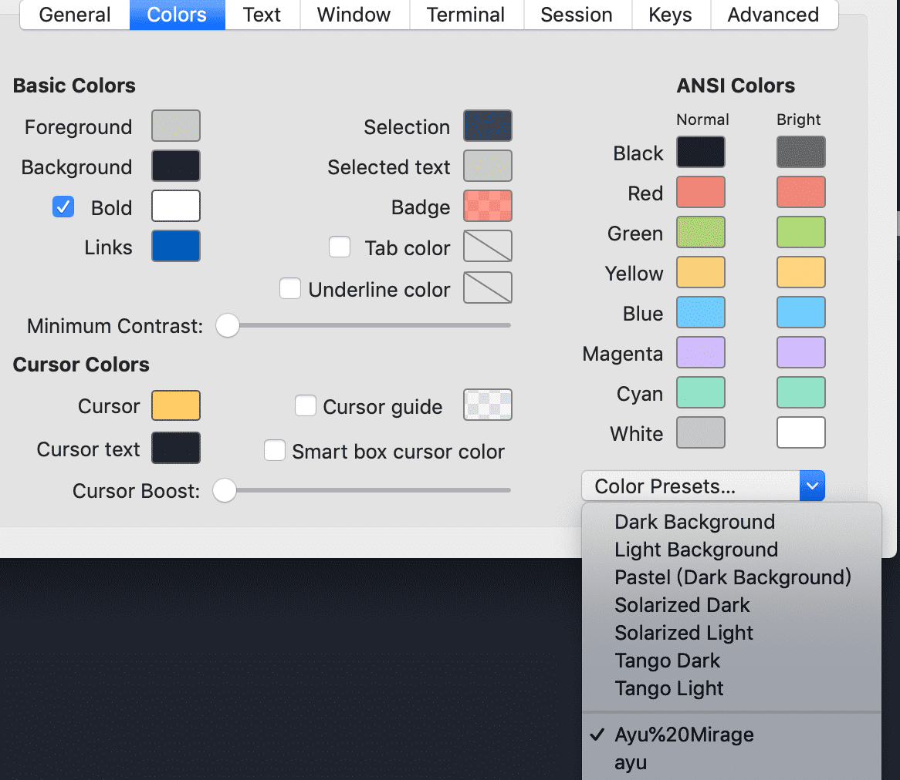

**[在 Youtube 观看视频版本](https://www.youtube.com/watch?v=AWtc3SQQPpI&ab_channel=%E7%A8%8B%E5%BA%8F%E5%91%98%E7%9A%84%E4%B9%8C%E6%89%98%E9%82%A6)**

今天的文章是关于：怎样打造一个比较完美的终端环境。
为什么想做这个教程呢？因为在我的慕课网的教学视频中，问的做多的一个和课程具体内容没关系的问题就是“老师，你的终端是什么配色和用了什么插件？”所以我发现非常多程序员在对某些和我们朝夕相处的工具都在追求高颜值：比如终端，编辑器，键盘等等。在这里，我想单独拿出终端来说说，它是除了编辑器以外最常用的工具，我们会从几方面来对它就行打造，最终让它既好看又好用，最后声明，这是一期比较新手向的教程，假如你已经是 shell 高手，我建议你就不用看啦。


> 我们最终的目标 - 自动补全，提示，命令行丰富的信息，字体，配色

### Shell: Bash/ZSH/Fish

本教程会采用 macOS 作为操作系统，其他操作系统原理类似，请大家自己去研究一下怎样移植过来。
首先我们来明确几个概念，第一个是 Unix Shell，如果去看 维基百科它是这么描述的：提供一个命令行界面，让程序员通过一些简单的命令（commands）去控制操作系统的行为。所以它是一个最基础的应用程序。

后来有一些程序员，发现了 Shell 在使用上有一些改进之处，所以它们基于 shell 做出了一系列的加强版，或者说是超集，bash 是其中最流行的的一个改进版本，它几乎是所有 linux 发行版预装的程序。
> Bash (bash) is one of many available (yet the most commonly used) Unix shells. Bash stands for "Bourne Again SHell", and is a replacement/improvement of the original Bourne shell (sh)

```bash
# 打开终端直接运行，就会发现它被预装了
bash --version
# 输出 GNU bash, version 3.2.57(1)-release (x86_64-apple-darwin18)
# 也并非所有都安装了Bash，以小巧著称的 alpine Linux 就没有安装
```

除了 Bash，程序员们还在孜孜不倦的推出很多魔改版本，比如
* ZSH - （添加了 cd 自动补全，拼写自动修复，插件以及主题的支持，Mac 自带安装，并且默认启用，我们最终要使用的 Shell）
* Fish - 简单的配置，各种插件
* PowerShell - Windows 的杀手锏，由于是近几年推出的，属于划时代产品，比 bash 厉害多了。

来测试一下：

```bash
zsh --version
# zsh 5.3 (x86_64-apple-darwin18.0)
```

如果发现没有安装和配置，可以按照 GitHub 的官方教程进行安装并且设置为默认 shell：
https://github.com/ohmyzsh/ohmyzsh/wiki/Installing-ZSH

### 终端 Terminal
用来运行各种 Shell 的软件就称之为 Terminal，Mac 和 Windows 都有自带的终端软件，但是 Mac 的终端非常简陋，连添加 tab 都不支持。所以有更多的选项，有很多大家应该都熟悉。

* iTerm2 （我们要使用的软件，https://iterm2.com/， GPL协议，免费）
* XShell ，Putty（专注于 SSH 远程操作）
* 跨平台的 Hyper （https://hyper.is/ 跨平台基于 electron，可以尝试下）

### 安装 oh-my-zsh

有了心仪的 shell 以及 terminal 以后，下一步就是配置让它变得更强大，之前我们说过 ZSH 支持自定义插件以及主题，那么我们要从哪里下载这些内容呢？在这里，我们可以使用 oh-my-zsh: https://ohmyz.sh/
它是一个开源的，社区管理的 zsh 的框架，里面预装了非常多精挑细选的插件，主题以及配置，就像一个合集，安装使用后，让你想不禁喊出 “Oh My ZSH”, 这就是这个名称的来源。

```bash
# 安装
sh -c "$(curl -fsSL https://raw.githubusercontent.com/robbyrussell/oh-my-zsh/master/tools/install.sh)"
# 因为上面是 github content 的内容，国内有可能需要代理
# https://gitee.com/mirrors/oh-my-zsh/raw/master/tools/install.sh
```

安装完毕，就会发现用户的根目录下会有一个 **.oh-my-zsh** 的文件夹。里面就有一系列的文件夹，包括 themes 和 plugins，这些就是预装的插件和主题，供你使用。这些内容都可以在用户根目录下的 .zshrc 文件进行配置，这个我们之后再说。

### 配置主题
主题由两部分构成，第一部分是 Iterm2 本身的主题，包括整个界面的配色，比如背景颜色，各种文字颜色等等，第二部分是 zsh 的配置，包括提示行的展示方式以及对应的信息等等，这两部分一起构成了一个主题。

**配置 Iterm2**

选择 preferences => Profile => Colors 进行配置，可以在下拉框选择 Presets ，就是一系列设置好的主题，除了默认的几种还可以在网上下载：[https://iterm2colorschemes.com/](https://iterm2colorschemes.com/)

下载完对应的文件，直接点 import 选择文件就可以了，比如我这里的 Ayu/ Ayu Mirage 就是我下载的几个主题。和我的编辑器主题对应，做到大一统的感觉。



> 在 iTerm2 中修改主题

我选用的 Ayu Mirage 主题，可以在这里下载：
[https://raw.githubusercontent.com/mbadolato/iTerm2-Color-Schemes/master/schemes/Ayu+Mirage.itermcolors](https://raw.githubusercontent.com/mbadolato/iTerm2-Color-Schemes/master/schemes/Ayu+Mirage.itermcolors)

### 配置 ZSH

oh-my-zsh 以及内置了很多主题，就在 themes 文件夹下，然后可以在 .zshrc 中进行配置, 效果可以在这里观看演示：[https://github.com/ohmyzsh/ohmyzsh/wiki/Themes](https://github.com/ohmyzsh/ohmyzsh/wiki/Themes)

```bash
vim .zshrc
# 修改对应的值，切换不同的主题
ZSH_THEME="robbyrussell"
# 修改完毕以后保存，打开新的tab 观看效果
```


> 修改为 oh-my-zsh 其中的一个主题

**特别注意，任何修改都是要在新的 session 中才能显示，重启 iterm2 或者打开一个新的 tab 就能看到结果。**

后来慢慢发现内置的主题，还不够我玩的，很多人都在推荐 powerlevel10k，它不是内置的主题之一，先来看看它的主页：[https://github.com/romkatv/powerlevel10k](https://github.com/romkatv/powerlevel10k)

它提供更多有意思的信息，并且有更多的可定制化的能力，如果想详细了解，大家可以去看文档，我们这里就直接来安装。

```bash
# 其实就是 clone 到对应的文件夹中
git clone --depth=1 https://github.com/romkatv/powerlevel10k.git ${ZSH_CUSTOM:-$HOME/.oh-my-zsh/custom}/themes/powerlevel10k
# 然后在 .zshrc 中修改为对应的主题
ZSH_THEME="powerlevel10k/powerlevel10k"
```

在安装完毕以后，重启 Iterm2，由于 powerlevel10k 会提供一个命令提供一个可视化的界面去配置对应的主题，只需要输入

```bash
p10k configure
```

### 安装字体

第一次运行 p10k configure ，如果它发现没有一个特定字体，它会自动下载一个等宽字体，对于编程字体，我想大家应该也是如数家珍，这里可以选择自己喜欢的编程字体。但是我还是推荐所有人都用它推荐的字体 - MesloLGS NF。

Powerlevel10k 关于字体的描述：
[https://github.com/romkatv/powerlevel10k#meslo-nerd-font-patched-for-powerlevel10k](https://github.com/romkatv/powerlevel10k#meslo-nerd-font-patched-for-powerlevel10k)

这个字体的特殊之处，它来自一个特殊的字体家族：[https://www.nerdfonts.com/](https://www.nerdfonts.com/) 看名字就知道专门给 nerds 提供的字体，它魔改了目前市面上非常流行的编程字体，除了字体之外还添加了非常多的图标，可以更丰富我们的展示界面。


> MesloLGS NF字体提供各种图标


> Fira Code 原版没有提供图标，会显示为问号

如果自动下载失败(因为字体源文件来自 githubusercontent)，可以在这手动下载 MesloLGS NF：[https://github.com/romkatv/dotfiles-public/blob/master/.local/share/fonts/NerdFonts/MesloLGS%20NF%20Regular.ttf](https://github.com/romkatv/dotfiles-public/blob/master/.local/share/fonts/NerdFonts/MesloLGS%20NF%20Regular.ttf)

大家还可以从 nerdfonts 选择自己喜欢的字体进行下载安装。这里的字体都是经过改装的，结合了字体和图标，具体地址请看：[https://www.nerdfonts.com/font-downloads](https://www.nerdfonts.com/font-downloads)

下载完后，双击字体文件进行安装，安装完字体以后，重启 iterm2 并且在 iterm2 中进行对应字体的配置，Preferences => Profile => Text => Change Font。

选择完了有图标的字体以后，就可以继续运行 

```bash
p10k configure
```

进行配置了，根据提示选择你喜欢的展示形式。

### 安装插件
最后我们来安装两个插件，在 zsh 中，插件指的是一些别名和函数的合集，简单来说就是完成特定的功能，oh-my-zsh 已经提供了很多默认的插件，这里我们来另外安装两个，这两个插件也是我平时用的最多，帮助最大的，建议大家都安装一下。
第一个是 自动补全 **auto-suggestion**，[https://github.com/zsh-users/zsh-autosuggestions/](https://github.com/zsh-users/zsh-autosuggestions/) 它可以记录你输入的历史记录，当你键入前面的命令的时候，他会显示之前输入的命令。

```bash
# 安装，其实就是 clone 到本地 oh-my-zsh 的 plugins 当中
git clone https://github.com/zsh-users/zsh-autosuggestions ${ZSH_CUSTOM:-~/.oh-my-zsh/custom}/plugins/zsh-autosuggestions
# 使用，编辑 .zshrc 文件
plugins=( 
    # other plugins...
    zsh-autosuggestions
)
```


> 会自动补全之前输入的命令

第二个插件是语法高亮 **syntax highlighting**，[https://github.com/zsh-users/zsh-syntax-highlighting](https://github.com/zsh-users/zsh-syntax-highlighting) 它可以用绿色或者红色显示你输入的命令是不是一个合法的命令以及一系列相关的高亮。

```bash
# 安装 同样的道理
git clone https://github.com/zsh-users/zsh-syntax-highlighting.git ${ZSH_CUSTOM:-~/.oh-my-zsh/custom}/plugins/zsh-syntax-highlighting
# 使用，同样
plugins=( [plugins...] zsh-syntax-highlighting)
```


> 高亮对应的语法，绿色和红色可以指示是否是合法的命令


### 安装增强应用程序 Fig

Fig [https://fig.io/](https://fig.io/) 是一个第三方软件，它不是一个单独的 ternimal 程序，它可以集成到对应的终端程序上，提供更丰富的任务。
它内部提供了一个接口，可以自动显示一些常用命令的自动补全，特别注意这个比之前的插件要强大，因为不需要时你之前输入过的。而是自动获取常用的命令，非常的好用。
大家可以自己去安装，操作都是傻瓜式的，很简单。看看最后的效果：

> 自动补全 git 的一些常见命令

好，经过一系列的操作，现在我们的终端看起来完美了，兼具颜值和效率，可以让你赏心悦目加事半功倍了。