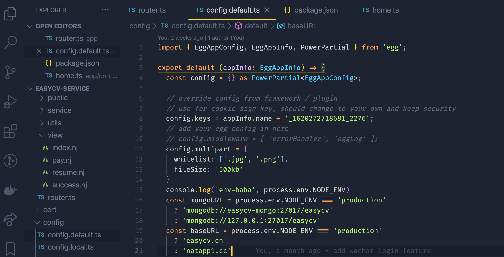
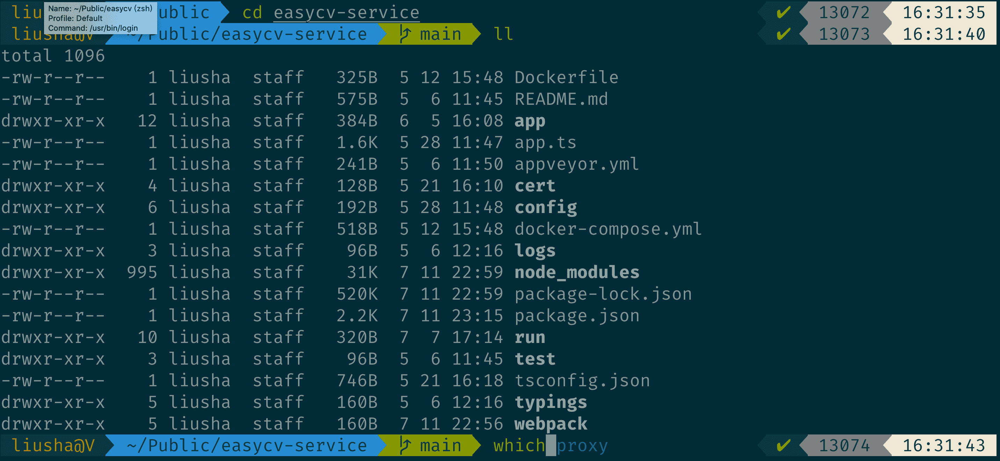
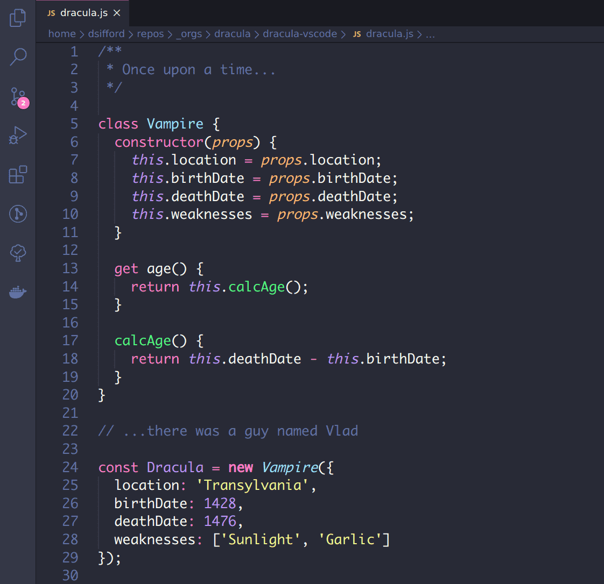
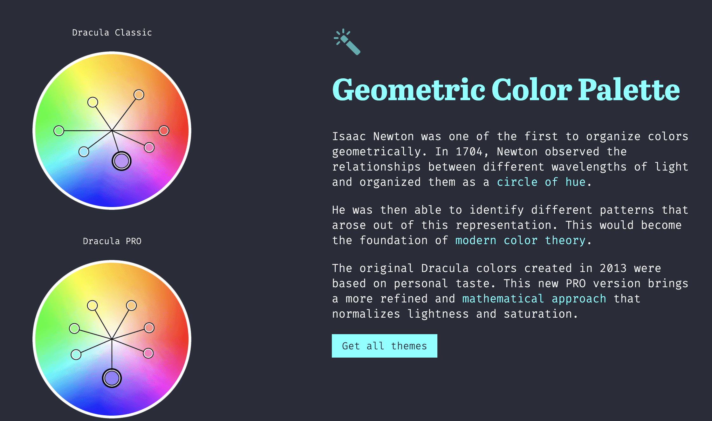
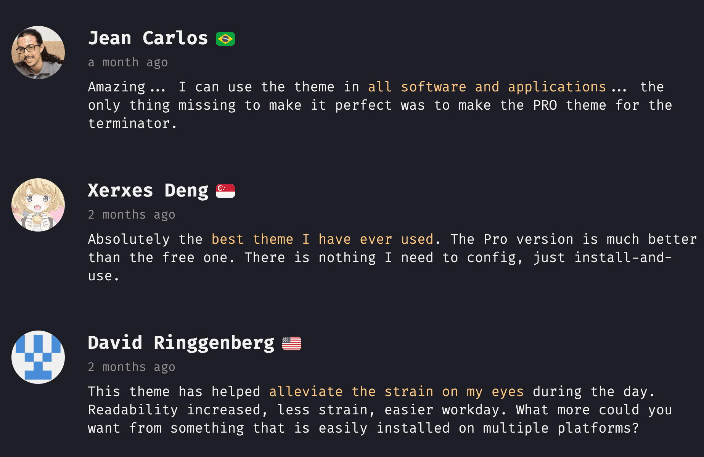
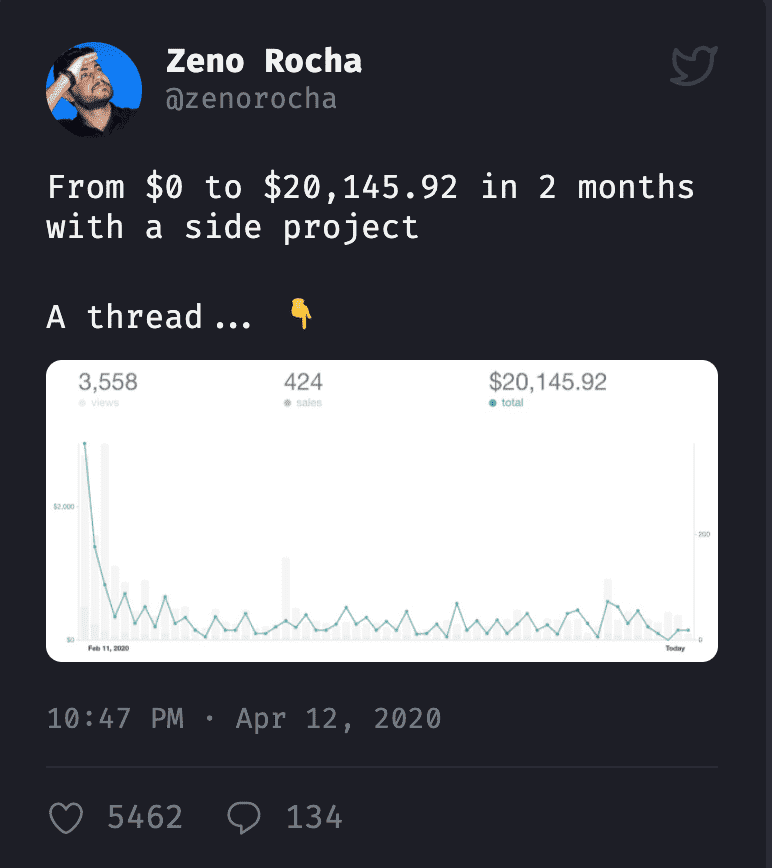

**[点击在 Youtube 查看视频版本](https://www.youtube.com/watch?v=6_oCxwTTdCo&ab_channel=%E7%A8%8B%E5%BA%8F%E5%91%98%E7%9A%84%E4%B9%8C%E6%89%98%E9%82%A6)**

大家好，今天我们继续来分享开源软件的故事，书接上回，上一次我们了解了 tailwindcss 的赚钱的故事，这次我们来说另外一个故事，正如标题所说，这次说的是一个称之为 Dracula Pro 的编辑器主题。

### 主题（theme）是程序员的心头肉
对于程序员来说，主题配色是一个非常重要的话题，主题（theme）使用在每天和我们打交道最多的一系列软件上，比如编辑器，终端，可谓是我们接触时间最长的几种颜色了，所以每个程序员都会乐此不疲的折腾自己的主题，一款心仪的主题可以让你写代码的时候赏心悦目，提高效率。我曾经也花了非常多时间来倒腾自己的主题。先来看下我的心头肉。

> Visual Studio Code 作者使用的主题 ：Ayu 系列 https://marketplace.visualstudio.com/items?itemName=teabyii.ayu  + FiraCode 字体 https://github.com/tonsky/FiraCode

>作者的 Iterm2 主题以及一系列插件（自动完成，检查命令正确，git等）来自：https://github.com/romkatv/powerlevel10k.git  https://gist.github.com/kevin-smets/8568070

在慕课网的视频教程中，很非常多的同学提问都和内容无关，而是问我用的是什么主题，可见作为程序员，一款好看的主题对大家是非常有吸引力的。

### 开源项目 Dracula 的发展

言归正传，回到我们的故事中，开源项目赚钱，那么首先当然有一个开源项目，这个主题称之为 Dracula，他来自于一个叫做 Zeno 的程序员。我们来它的官网看一下，
[https://draculatheme.com/visual-studio-code](https://draculatheme.com/visual-studio-code)，在 Github 上，它有16k 个 star，它对特别多，几乎市面上所有的编辑器做了对应的适配。Dracula 中文译名就是 德古拉，大家应该都非常熟悉这个名字，它的原型是大名鼎鼎的吸血鬼伯爵，在官网针对它还有一句有趣的调侃：
>"Are you going to create a light color scheme?"
>Nope. Dracula can't stand the light.

> Dracula 在 vs code 上的效果

最终的效果，怎么说呢？对于一个深色主题，还算可以吧。但是不特别是我的菜。这个项目开始于 2013 年，算是非常长寿的项目了，让我非常敬佩的是作者的对于这个项目的管理，按说，就这么简单的一个配色的方案，应该没啥具体的内容。但是作者很用心的匹配了几乎市面上所有的终端和编辑器。他为了让维护这么多不同内容的更加方便，将原来的一个 repo 变化成了一个组织，每个工具对应一个 repo。还发展出了一个小的 team。这种工程化的思想，非常难能可贵，谁能想到这么简单的一主题还能发展出一个组织呢？
我见过很多同学能写出非常出色的开源项目，但是在宣传过程中没有太多的经验，最终结果就是辛辛苦苦写的项目无人问津。所以我觉得这对于致力于开源的小伙伴来说是很好的经验。
在作者的努力下，Dracula 非常受欢迎，star 数量开始激增，这个时候他也开始了开源软件火了以后的思索，这么多人使用，这么大的流量，怎样来完成变现呢？

### 付费项目 Dracula Pro 的诞生
作者这个时候的做法是制造差异化，做一个付费的项目，所以它在 Dracula 的基础上又开发出了 Dracula Pro，一听 Pro 这个名称就让人感觉不明觉厉。但是简简单单换一个颜色能打动挑剔的程序员去付费吗？那肯定是不够的，所以这个时候它就想到了捆绑销售，来官网看看：[https://draculatheme.com/pro#get](https://draculatheme.com/pro#get)

首先人家就把口号给想好了，产品可以小，但口号必须要大，要政治正确，pro 的口号就是 more than just a theme，不仅仅是一款主题，格局一下就上去了。

那么它究竟都包括啥呢？
首先提供一揽子主题，六个任你挑选，在介绍主题的时候，一阵神奇的话术:

> Pro 主题的介绍，什么牛顿发明色相环，什么现代色彩理论，新的主题赋予更科学的色彩理论都跑出来了，颇有钟薛高的设定，皮肤届的爱马仕。

除了主题，还提供了精心挑选的编程字体。还有一本教程序员怎样提高工作效率的电子书。所以现在他推销的不仅仅是几个色彩值，而是一个程序员本地开发的大闭环。所以我认为对于一个自己的产品，包装也非常重要，不仅仅是外观的包装，话术上的包装也同样重要，去看看 Pro 的官网就知道，给人感觉就一个词：专业。浏览下来就感觉他卖的不是皮肤，而是更大的一个理念。
最后我们来看看价格，79刀，不禁感叹国外程序员付费购买的习惯和意愿。不过令人可喜的是，现在在国内，新的一代年轻人已经对知识付费的接受度越来越高了。

>PRO 提供的字体和书

### 从 0 到 14 万美元

在 Pro 项目创建完毕以后就是怎样销售的问题，对于一个独立开发来说，开发其实是最简单的，而销售其实是最重要的一个环境，怎样将自己心爱的产品推销给别人，这是一门学问。Zeno 特别写了一篇非常好的文章记录了这个过程，[https://draculatheme.com/pro/journey](ttps://draculatheme.com/pro/journey)
文章的标题就是 **a solo journey to 100k**, 独立开发赚 10 万美元的历程。强烈大家看看原文，图文并茂的展示了整个过程，不仅给出了一些基本的做法，还将那个时间段他的 tweets 都进行了分类展示。我这里简单归纳一下他是怎样做的。

把时间拨回到 2020年一月，

#### 旅途开始，收入 0 美元。

Dracula 开源项目已经非常成功，使用者经常会通过各种途径来联系他询问各种问题，但是由于他没有没有那么多精力去维护，一些用户会感觉有些不悦，这个时候他感觉到他需要创建一款付费的服务，给用户更棒的体验。所以他在 twitter 上宣布自己开始创建一个新的付费项目。

>People are tired of using crappy products with no support. That's why I decided to focus on creating a premium experience instead.

由于有了之前开源项目的积累，那些开源主题的死忠粉丝已经给新的 Pro 站点已经有了流量，但是还是一个静态页面，缺少建立和用户沟通的途径，所以他开始创建一个 email list，同时用无代码平台 typeform 创建了一个调查问卷，和用户建立联系。他认为早期和用户建立联系非常重要。
> Although I had traffic coming to the site, there was no way for me to contact people directly, so I began to build an email list.

#### 2020年二月，在公众面前成长。 售出 220 份 收入 9918 美元

Zeno 根据用户的一些意见辛勤的创建 Pro 主题，在发布之前，他询问了他的一些死党的意见，他非常看重前期产品在不同角色用户的看法，并且认为这是好产品的制胜法宝。

> Before launching to everyone, I asked some of my close friends about their opinions. Getting early feedback is key to a good product launch.

他将自己的销售数据以公开的方式发布在网上，吸引了非常多人的注意，他不赞同很多人认为的公开数据只能引来同行的竞争。公开销售数据的这种方式现在在独立开发者中很流行，这种方式称之为 open startup，也是吸引眼球和流量的另类方式。比如一个非常出名的独立开发站点 nomadlist 的公开数据。
[https://nomadlist.com/open](https://nomadlist.com/open)

> People are afraid of sharing sales numbers as they think this will attract competition. The only competition you have is yourself.

#### 2020年3月，第一笔退款。收入 17476 美元

对于一个项目来说，当有了收入以后，你会对它更有兴趣，更想把它做好，这是有别于开源的一个另类的体验。所以在这一阶段，zeno 继续精进自己的产品，推出了更多适配，开源了设计文件，官方网站重构。但是这时候也发生了用户的第一笔退款，这让他感到很受伤，但是没有完美的产品，我们能控制自己所能做的，但是不能控制别人的所想所为，所以在生活中，也要有这种不以物喜的态度。
>It’s painful to process your first refund request. It feels like you failed and that you’re not good enough. Still, you have to understand that there’s no such thing as the perfect product.

还有一条非常重要的策略就是，让用户写关于产品的使用评价，从而来创建“social proof”，最初的客户是最重要的，保证让他们用的满意。

> Dracula Pro 官网的用户评价

> Sharing stories from users is really important and creates social proof. Your first customers are the most important - make sure they are happy.

#### 2020年4月，病毒式扩散 收入 29730 美元

Zeno 继续将所有的数据和经验持续更新在 twitter 上，这种方式让产品持续的曝光在其他人的时间线上，别人可以从中吸收到很多的信息，同时产品的关注者也越来越多。这种积累可以出发量变引起质变的效果。
他发出的一个 twitter 突然就火了，当然标题也很有噱头“两个月，个人项目从0到怒赚两万刀”，这个给主题的销量带来了非常强劲的上升。

我之前的twitter 也有这种感受，我之前的视频在某个 大 V 点赞以后，一下带来了好几百个 likes，和几百个关注者。所以他认为 持续 透明 的分享，一个项目的经验，更新，收入等信息，可以给产品带来利大于弊的收益。
> Transparency is a scarce resource. When people see someone sharing numbers and lessons openly, they get inspired by that, and you get credibility in return.

#### 2020年5月-7月，持续迭代 收入 52879美元

在收入相对稳定之后，Zeno 开始在项目中持续添加更多的内容，在他的设想中 Dracula Pro 不能仅仅就是几款主题，所以在这个阶段，他又持续推出了一系列 Pro 的特殊内容，比如之前所说的电子书，-《14 HABITS OF HIGHLY PRODUCTIVE DEVELOPERS》，高效程序员的 14个习惯。这本书不仅包含在 Pro 中，也在 amazon 和 gumroad 单独售卖，我看了一下，amazon 的评价还很不错。[https://www.amazon.com/dp/B08BF74RRG](https://www.amazon.com/dp/B08BF74RRG)

针对这本书和整个 Pro 的内容，他又整体录了很多 podcast 来配合销售，让更多的人们了解他的产品。他有这样的一个理论，没有“酒香不怕巷子深”这种说法，必须不遗余力的宣传自己的产品。
> Once the book was out, I did many podcast appearances to spread the word and attract a new audience. There's no such thing as "build and they will come".

#### 2020年8月 - 2021年2月 达到目标 收入 101578 美元 

后面就没有什么特殊的内容了，经过前面的铺垫，这个产品有一定的口碑和基础以后，就是随着时间进行慢慢的进行迭代和进化了，在这期间，他还是持续输出自己产品的销售数据，举办Dracula 线上社区以及活动，用户变多维护成本升高所以涨价 等等内容，其实它的开源产品盈利模式和上一次讲的 tailwind.css 的模式非常类似，也是在基础版本上推出更专业更个性化的产品，供人们选购。所以他的得出了开源软件盈利的几种模式。
* 1 广告 
* 2 卖 license
* 3 咨询
* 4 赞助
* 5 提供高级服务

这也涵盖了我能想到的所有途径，如果你有一个非常火的开源项目，并且想用它盈利，不妨可以从这几个角度进行考虑。

### 结束
今天的故事到这里，另外一个开源的故事，更加丰富的内容，我们不仅概括了它盈利的产品，还回顾了整个产品发展的历程和经验教训。
简单总结一下，应该有这几点我们可以一起学习下：
1 格局必须够高，口号要响亮，话术是产品的一个重要组成部分。
2 最早期就创造和用户沟通的途径，倾听早期用户的反馈。
3 公开，持续分享销售细节以及整个发展过程，吸引更多人的关注，毕竟提到钱大家都会不经意的点开的。
4 根据用户需求，快速持续迭代，添加新的功能和模块。