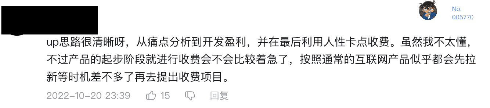

**[点击在 Youtube 查看视频版本](https://youtu.be/BhxKl9JqDdU)**

## 里程碑

大家好，我是简单简历（[https://easycv.cn/](https://easycv.cn/)）的创始人张轩，它是我独立开发的第一个产品。11 月 7日对于我的产品来说是具有纪念意义的一天。它的盈利达到了 **2000** 元，虽然不多，但是是我人生中最激动的一笔收入，特别感谢支持我的用户，多次强调，我的产品会 **build in public**，所以在这里我想分享一下第一个2000元过程中我的收获，经验以及教训，盈利的组成，MMR计算，冷启动流量的来源等等话题。

## 前情提要

我会持续的记录产品发展的流程，在之前的视频文章中我已经写了前因后果，大家在这里去了解：

**我独立开发的产品是怎样获得最初的 300 个用户的？**：[https://vikingz.me/first-300-customers/](https://vikingz.me/first-300-customers/)

这篇文章是系列的第一篇，记录了项目的缘起，发展，怎样获得最初的用户等等，没看过的可以先读一下。

## 盈利的三个关键点

上一篇文章说过，如果你要做一个收费的产品，那么从开始的第一刻起就要**明确产品的收费点**是什么，这很重要，不要想着一开始就是先赚眼球和流量，盈利模式之后再摸索，对于一个独立开发的小产品来说，这样做是错误的。之前 B 站上有个留言是这样的：

> B 站用户的留言

我并不是很认同这样的观点，简单简历从一开始就找到了很关键的收费点，高级会员和普通会员有一系列的区别，尤其是下载简历，目前是收费的一个最大的需求和功能。

> 简单简历高级会员的功能

第二点是不要赚**不道德**的钱，在用户付款之前，要写清楚付费的金额，时长，是否自动续费等等关键要点，不要隐藏收费，不要诱导消费，不要在宣传上造假，不要抄袭或者恶意攻击别人，不要贩卖用户数据，尤其是在当今熙熙攘攘，皆为利来的社会，恪守产品的底线是一个非常重要的优点。如果你在创造一个优质的产品，你不需要这些不道德的手段。

第三点是“**看起来像那么回事**”，你的作品需要一个比较得体的设计并且有比较丰富的周边性内容，让一个用户在一个陌生的网站直接付款是需要很大的勇气的，不能让用户看完了你的产品以后觉得你随时都可能跑路。我在产品除了主编辑器之外，准备了非常多的周边内容，[https://docs.easycv.cn/](https://docs.easycv.cn/) 详尽的帮助文档，简历书写指南，博客，更新日志，路线图等等。让用户看完了他会安心一些，觉得这个人真正的是在做正经，长期的产品。他的付款意愿就会更强一些。

## 收入分析

说完了盈利的关键点，就来说说这两千元的收入是怎样组成的，先来看看整体的盈利，时间是从 8 月 19 日到 11 月 7 日，如下图所示：

> 整体盈利

总体盈利其实没办法很好的反应产品的发展，因为会员是有三个等级，一次性付三种不一样的费用的，10元/月，66元/年，188元/终生。所以假如有偶然事件发生，比如一个月有好几个终生会员，那么趋势就不准了。

**MMR** 

现在订阅收费模式的网站都使用 MMR 来衡量，MMR 全称是 Monthly Recurring Revenue，他是将年付以及终生分摊到每个月上，假如在十月份我们新增一个月付用户，之前留存各有一个月付，年付和终生用户。

那么 MMR 就是：**10 + 10 + 66/12 + 188 / 36（我们先简单的将终生用户算成三年） =  30**

那么现在来看下 MMR，

> 使用 MMR 计算后的结果

因为分摊的模式，总收入肯定是减少的，因为年付和终生会被分摊到未来去，但是 MMR 可以更好的反映应用的发展。我们可以观察到整体的盈利状况是上升的，这是一个好的趋势。

还可以从中发现问题：我的产品在付费模式上其实一直有一些问题，因为看起来是订阅制，但是国内的 Web 端产品很少有像国外那样的信用卡每月自动扣款的机制，所以月付用户其实大多是**一锤子买卖**，很少有持续订阅的，很多用户购买就是为了使用下载简历的功能，对于其他的会员服务并没有很强烈的付费欲望。所以怎样提供给高级用户更多的长效的特权功能就是提高收入一个特别要注意的点。

经过观察统计数据，还可以得到一个地球人都知道的道理：网站流量和收入是成正比的。所以提高盈利的方式就是提高流量。

## 各种流量池

再来说说市场推广最重要的流量来源，工程师讨厌市场推广，但是我们不得不做，上篇文章我简单讲了初期流量的获取，这里我再分两部分配合数据仔细讲讲。给大家讲讲现在优质的流量池都有哪些。

这两部分流量，第一我称之为**个人品牌，**你自己的圈子可以带来的流量。另一个称之为**冷启动**，特别适合没有特别强社交影响力的开发者。

首先我们来看看统计数据，这是我添加统计以来所有 PV 的来源。统计数据是从9月底才开始添加的，会缺失一部分的流量，但是也能大致看出排名来。当然这是初略的统计，有些平台没有 referrer，比如公众号和 B 站，在文章和描述中都不能添加 URL。所以没发统计多少是从这两个平台来的。

> 网站来源统计，可以清晰的看到不同网站带来的导流效果

从上面的统计数据可以除了直接访问之外，我的一大部分流量都来自**推**，因为在那里我有一万多粉丝，同时用户非常对口，也很优质。我会定期结合产品写一些真正有帮助的帖子,比如这个：

> 在推上的一个帖子，有不错的效果

不要写硬广，而是要结合内容写真正的干货，在帖子中记住要直接添加URL，让用户方便点击，既宣传了网站，也可以帮助别人。这个帖子获得了600多赞，贡献了一千多的 PV。所以再次强调，**一千个粉丝理论**是非常重要的。

让我比较好奇的是，我的**个人网站**也贡献了比较多的流量，我以为这个浮躁的年代，个人网站已经完全是小众的爱好了，因为视频平台我都提供了对应的文字链接，留的是个人网站，所以从这边的二次导流也是比较多的。

再来说说视频，上一篇文章的视频我发在了两个平台，两个平台的粉丝数差不多，都是两千多，但是流量非常神奇，油管非常稳定，是几百多，而 B站 则是神奇的流量波动，居然达到了一万多，比之前的视频多出了几十倍，估计在 1024 前后发的触发了某些推荐机制。

**冷启动流量**

假如你的个人品牌还没有完全成熟，只是有作品，那么我推荐这几个网站可以作为冷启动的流量来源，这几个是我尝试以后觉得不错的途径，从上面的统计也能找到它们的身影，我在之后会尝试更多的来源，给大家更多的一些选择。

第一个首推 **v2ex**，[https://www.v2ex.com/t/888638](https://www.v2ex.com/t/888638) 我之前也完全没玩过，完全是第一次注册发帖，但是就获得了非常可观的流量，而且比较多人留言，是非常优质的平台。统计显示，他排在流量来源的第三名，帖子有 **1976** 次点击。

第二个 **知乎**，[https://www.zhihu.com/question/24667846/answer/2719890849](https://www.zhihu.com/question/24667846/answer/2719890849) 虽然我在这两个平台有一些粉丝，但是真正获取流量是它们两个平台的推荐机制，知乎发表文章以后**一定要选择投稿到特定的问题**，然后选择一个比较火的类似问题。我们来看一下数据。

> 知乎投稿到某问题以后，数据要多得多

最终它获取了 **2263** 次阅读，**18** 赞 和 **34** 次收藏。

第三个 **豆瓣**, [https://www.douban.com/note/839522926](https://www.douban.com/note/839522926) 我主要是发日志的方式，其实估计在小组发帖更好，但是我没试。比较重要的是 tag，创建日记的时候**必须要填一些比较热门的相关的 tag**，然后用户可以根据这些 tag 到你的文章，点击数一般，聊胜于无。

最终它获得了 **491** 次阅读，**17** 赞 和 **31** 次收藏。

第四个 **小红书**，[https://www.xiaohongshu.com/discovery/item/635c9892000000001402823a](https://www.xiaohongshu.com/discovery/item/635c9892000000001402823a) 没想到我这个猛男也去尝试一下小红书，它的玩法很不一样，图片友好，文章没人看，而且不能发链接，不能硬广，否则降优先级，我作为完全新人就另辟蹊径发了一篇，同样 tag 很重要，我一口气填了一系列的 tags，同时将内容巧妙的设计了一下，将链接隐藏到内容中，没想到最终它获得了 **1928** 次阅读，**13** 赞 和 **7** 次收藏，但是能换来多少流量呢？没人知道。

其他 **w2solo**，[https://www.w2solo.com/](https://www.w2solo.com/) 独立开发者论坛，流量也有点，可以尝试下。还有可以在社交媒体上 at 大V，如果真的好的内容，对方是愿意帮你转发或者点赞的，这样可以蹭到不少流量。

## 设定曝光日程表

**推广和流量的正向关系**

在不同平台的推广和流量有非常紧密的关系，如果你去看我的 PV，一条成功的发帖可以让流量达到顶峰，然后随着时间的推移，慢慢的回落到一个稳定值。

> PV 变化趋势，可以清晰的看到随着宣传流量的变化

所以根据这个规律，要持续的进行发帖推广让产品持续的曝光。不要一次把所有的好货都发出去，也不要两个月都没有任何宣传。保持一个固定频率的曝光对产品是最好的。

这是一个长期的任务，也是一个考验你耐心的任务，很多同学做东西都很容易三分钟热度，所以这里为了约束自己去按时间完成任务。

我们可以设定一个发布日程表，将未来要做的决定和产品有关系的主题都先想好，然后按照一个固定的频率进行发布，比如半个月一次或者一周一次。注意这里最好是将这个日程写在某处，设置提醒，而不是放在脑子里就好了，相信我，仪式感是战胜拖延症的最好武器。

> 未来要发的文章列表，并设置好 deadline

## 结语

这是我的产品第一个 2000 元的故事，在发展过程中实验非常有趣，尤其是看流量的获取与变化，让我学到了很多。这个产品在之后会作为一个实验，会一直迭代，一直公开，会持续的给大家分享产品发展路程上的经验教训，最后欢迎大家持续关注我独立开发的旅途。

