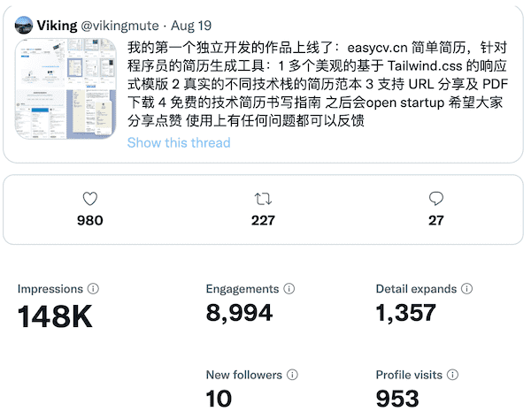

## 缘起

大家好，我是简单简历（[https://easycv.cn/](https://easycv.cn/)）的创始人张轩，它是我独立开发的第一个产品。

很多人是通过我关于程序员自由职业以及独立开发的故事认识我的，我在2019年开始自由职业，想探寻一条程序员 B 计划的实现方案。

我在前两年是以慕课网讲师的身份在进行实践，两年半的时间我出品了一系列比较受欢迎的[前端开发的课程](http://www.imooc.com/t/6012904)。让我有机会完成了初步的积累，每个月可以拿到和原来上班差不多的固定收入。

俗话说：“鸡蛋不能放在一个篮子里”，我希望探索更多的途径，比如说自媒体（程序员的乌托邦），虽然没有认真打理，各种社交媒体的关注度都发展的不错。

但是作为一个程序员，我还是想做一个针对程序员的产品，可以帮助到别人，产生一些真正意义上的影响。

## 产品的需求从哪里来？

很多人每天都会迸发出很多点子，有些人会涉足一些已经非常成熟的需求和应用，重复造轮子，比如记账，无数的程序员都在做类似的东西。

而我的目标是先关注**一部分人小众的需求**，因为不管这个团体有多小众，当乘以庞大的基数的时候，都还是一个很恐怖的数据。当你真正能解决这部分的人的问题的时候，那么你也就成功了。

现在技术圈很浮躁，太多人开口闭口都是要做改变世界的产品，而我正好相反，**我想做小产品，把小需求做好，服务一小部分人**。

那么这个需求是什么呢？需求不会凭空而来，要关注生活工作中自己真正的痛点。

正好我在教学的过程中，有很多同学都会面对面试以及找工作，我发现一个非常普遍的问题：**一封技术简历应该怎么写？**

很多同学还是在百度上随意的搜索 “XXX简历” 的模版，随意的填写一些毫无亮点的内容，用着混乱，不美观的简历格式，自然和心仪的工作无缘。不会写技术简历是一种普遍的现象。

## 调研和发现

市面上已经有非常多的简历工具了，如果你去搜索简历，会有很多类似的工具，我都调研以及使用了它们的功能，并不能完全覆盖我的需求。 我认为，互联网从业者的简历，应该开始有别于其他行业的简历的，它应该从内容和格式上都体现技术的特点以及严谨。

在简单简历有这样的特性：

* 基于现代浏览器，符合 Web 标准，支持响应式的简约或者个性化的模版。[简单简历的简历模版](https://www.easycv.cn/templates)
* 可分享的，URL是当前互联网的根基，现代的简历应该支持 URL 直接访问或者通过手机扫码访问。[高级前端开发工程师在线简历](https://r.easycv.cn/seniorFE)
* 从内容上说：应该是充满技术亮点，让面试官眼前一亮的感觉，这正是很多同学所欠缺的。[简单简历的简历范本](https://www.easycv.cn/examples)
* 可下载的，最好是 PDF 格式。

其他的简历网站都希望做大，包罗的模版越多越好，恨不得从程序员到厨师都能找到对应的模版，而我想越做越小，做我了解的行业，解决身边遇到的真实的问题，帮助一小部分人，那么这样的产品也是有价值的。

如果你正有写简历找工作的需求，不妨可以试用一下我的产品 （[https://easycv.cn/](https://easycv.cn/)），我相信它会给你带来一些不一样的感觉。

> 简单简历的首页截图

## 明确盈利模式

假如你要做一个收费的产品，那么很重要的一部分想好你的盈利模式是什么？有良好盈利途径的产品才能是一个成功的产品，有太多的被资本裹挟的互联网产品一开始就是疯狂的招揽用户，疯狂烧钱过后发现根本没有良好的盈利模式，最后一地鸡毛。比如当时很火的共享单车，OFO，摩拜等等。

简单简历的盈利模式很简单: [https://easycv.cn/pricing](https://easycv.cn/pricing), 订阅模式，月付/年付/终生三种收费模式，付费可以享有一些关键的功能，比如下载，更多的模版，个性化 URL，高级设置等等。后面会讲到它是被验证可以行的通的。

> 简单简历高级会员的功能

## 市场推广

大家都知道，程序员不缺好的作品，而是怎样在市场上推广自己的作品，这也是我的第一个产品，所以整个过程对我来说也是非常有试验性和挑战的。这是本文的重点，我希望和大家一起分享记录下来。

## 凯文凯利：1000个铁杆粉丝理论

凯文凯利是科技界一个非常出名的作家，他在自己的书中提出过一个烂大街的理论：**1000 个铁杆粉丝，**。大意就是：想要成为成功的创造者，你不需要太多的基础资源，数百万元启动资金，数百万的客户和粉丝，你只需要一千个铁杆粉丝，不管你出什么内容，他们都愿意购买，那样靠这些人，你也可以实现不错的生活。

所以，在做任何产品之前，先扩大自己的社区和影响力是很重要的，从我自由职业开始的第一天我就在践行这个理论，个人品牌在当今社会非常重要，将自己作为一个品牌进行销售，当然其中有一些玄机，我在之后会单独做一起视频说说我创建个个人品牌的一些经验。

三年以来，我从慕课网的课程中收获了一批学生的粉丝，通过不断持续分享自由职业的心得以及一些程序员常用的资源收获了社交媒体的粉丝，包括推，b站，知乎，油管，公众号。推算是比较成功的，当时有 7000 粉丝左右，其他不是爆炸级的增长，因为说实话我没有非常用心，3年我就发了十几个视频。但是只要你坚持下做有趣的内容，还是会慢慢增长的，油管有 2000 多粉丝。

我第一次发布的宣传在推，这个时候我已经具备了 1000 个铁杆粉丝的基础。

## 第一批用户

在完全推广出去之前，你需要你的首批测试用户，独立开发的产品就像程序员的孩子，在发布之前，即使你知道有可能没有多少人用，也会非常紧张，我记得发布的当天我测试了一遍又一遍，就是不敢运行上线的脚本。最终一个朋友主动问我开发的怎么样了？我就发给他让他试试看，他的反响很好，然后还帮我提出了一些意见以及 Bug。他的反馈给了我极大的信心，你的第一批用户就可以是你身边的朋友，同事以及亲戚，他们是最能包容你也是比较真诚的用户。所以我之后就把链接陆续发给了几个朋友让他们帮我测试以及提意见。注意这些用户最好是专业对口的，比如我找的都是互联网从业者。就这样我收获了第一批大约十个用户，同时他们的反馈极大的增强了我的信心。

## 正式发布

我在 8 月 19 日正式公开发布，在推上发了一个帖子，同时有四张截图。

整个帖子传播的很不错，技术探讨的氛围也很好。由于关注我的大多数都是程序员，所以几乎是定向投喂，带来的流量也有很高的转化率。

> 这条帖子的一些数据，impressions 达到了 148K

所以一千粉丝理论非常重要，做产品先做个人品牌，有了粉丝你做什么都能带来比较好的宣传效果。

## 从 MVP 中验证商业模式

从最初的流量带来的数据，可以帮我很好的验证产品的商业模式，我当时都没有添加任何的统计工具，只能从数据库查到一些简陋的数据，从这样的数据也能验证你的商业模式是否正确，所以在产品早期去验证是非常重要的，假如你发现流量很大，但是没有人付费，也会说明很多问题。

在 八月 19 日到九月底的时间内，总共注册了 **220**个用户，创建了 **250**份简历，其中 **21** （还有 **3** 个终生会员，个人魅力无遗了，😄）个成为付费用户，这个付费率我很满意，接近百分之十，从数据也可以发现创建美观的简历，找工作是每个人的强需求，为了下载简历，很多人愿意付费。如果在未来流量上升以后，盈利提升也是可以预期的。

## 持续曝光，有机增长

时间来到十月份，这个时候推上的导流已经大大减弱了，这个时候产品还需要持续的曝光。那么很自然，还需要通过文章视频从其他平台引流。

对于文章，我认为不要写硬广，而是围绕产品的主题，写言之有物的文章，顺带推荐自己的产品。我这次发表的内容是：[《半小时视频+万字长文教你怎样打造程序员的金牌简历？》](https://www.youtube.com/watch?v=FUyo_LeG7II)，我对自己的视频和文章要求比较高，每个视频都配合对应的文章，争取在多个平台发表，多少都能带来一些流量，苍蝇腿也是肉。发布的平台有：公众号，知乎，B站，油管，个人网站。不得不说公众号太烂了，垃圾编辑器，不支持链接，而且对于这些很技术性的文章，流量都很低，但是为了那么一点流量，我忍了。不过后来所有的文字内容的链接，我都留了个人网站的 Permlink。

虽然是一次没有那么成功的宣传，一个原因有可能是文章太长了，导致视频时间过长，很多人都无法看完，但是还是获得了将近 **80**个用户，新建 **120** 份简历，新增 **11** 个付费用户。

> 简单简历累计数据，用户量，简历创建数以及付费用户

## 独立开发之旅

这就是我的产品最初 300 个用户的故事，这个产品在之后会作为一个实验，会一直迭代，一直公开，之后会公开盈利。这种模式称之为 **build in public**。也是为你的产品获取流量的一种方式，同时在这个过程中的经验教训和所有人分享，是非常有意思的事情，尤其是作为一个程序员，突然跳出自己的舒适圈，去接触市场，看数据的变化，我认为每个人的人生就是要一直挑战不同的领域才会更精彩，最后欢迎大家持续关注我独立开发的旅途。

