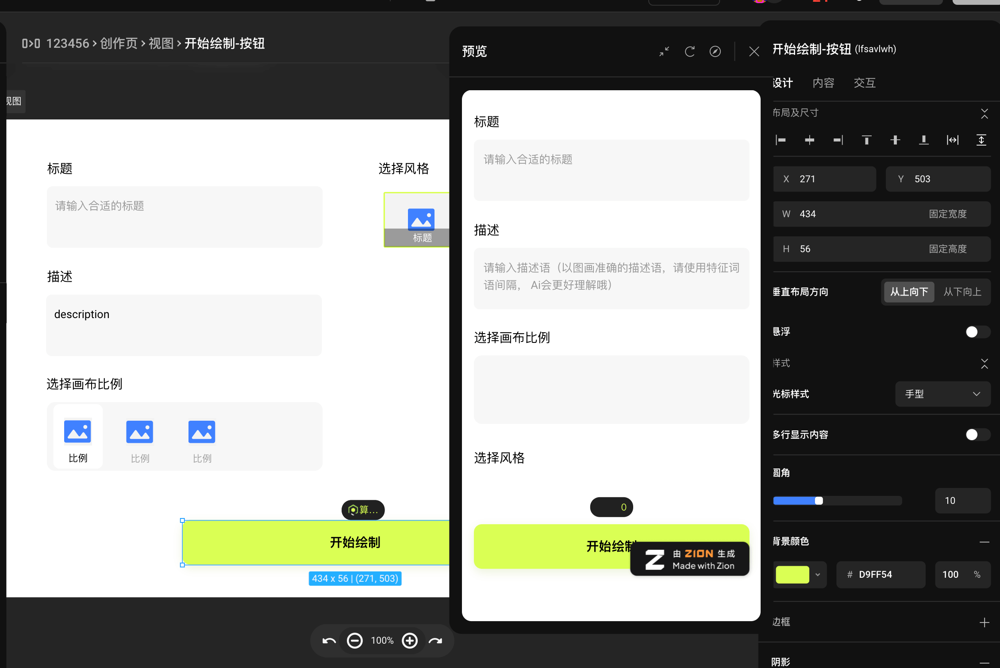
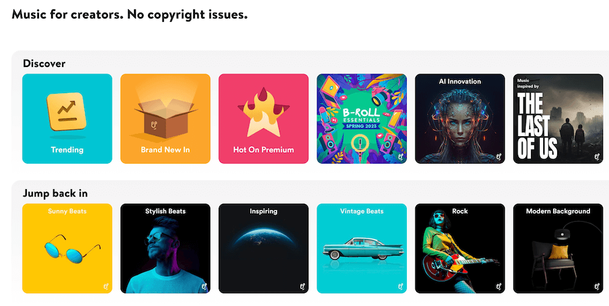

**[点击在 Youtube 查看视频版本](https://youtu.be/4vVTtTO9cRc)**

**[点击在 B站 查看视频版本](https://www.bilibili.com/video/BV14h4y1o7ym/)**

## 前言以及回顾

大家好，好久不见，我是简单简历，[https://easycv.cn](https://easycv.cn/) 的创始人张轩，它是一个专注于互联网从业者的简历生成工具，它已经上线半年有余，也经历了众多的里程碑。

我一直在记录产品的一些阶段性的进展，如果感兴趣，大家可以按时间线阅读或者观看以下的文章/视频：

* [我独立开发的产品是怎样获得最初的 300 个用户的？](https://vikingz.me/first-300-customers/)
* [我独立开发的产品是怎样赚到第一个 2000 元的？](https://vikingz.me/first-2000/)
* [不上班的1000天，程序员自由职业 B 计划 - 做什么/收入/经验教训](https://vikingz.me/1000-days/)
* [小小里程碑，独立开发的作品简单简历月收入达到2000元](https://vikingz.me/2000-mrr/)

今天我们来谈谈大家非常关心的**钱**的问题，独立开发一个项目控制成本很重要，最近一年互联网裁员也非常严重，所以消费降级在不断被提及。不仅仅是小公司，大公司也在控制成本，越来越多的大公司在逃离云服务，改为自己搭建一些服务。

所以文章中我就要讲讲在整个项目中，我是怎样使用一些免费的服务来替换掉收费的服务，从而以最低的成本运营整个项目的。

先说一个结论，使用这些服务可以让我一年至少节省 **5000** 元。接下来让我们看看有怎样的不同服务：

## 无代码（no-code）建站平台

除了主站之外，我还有一些快速建站的需求，配合特定的时期完成宣传，要求快速并且美观的实现一些应用。虽然是程序员，但是无代码平台能帮我更快的完成任务。

这里我选择了 **Zion 无代码开发平台**：[https://www.functorz.com/?channel=vkg](https://www.functorz.com/?channel=vkg)

作为国内的一个平台，它最强悍的功能应该就是可以快速搭建小程序，小程序作为国内一个比较特殊的应用类型，假如编码的话，还需要学习另外一套体系和语法。我使用它很快就搭建好了小程序，节省了很多时间。整个过程是完全可视化拖拽的方式完成的，它还兼备了实时预览的功能，省去了打包部署的流程。

它还有一大特点就是组件的灵活性，能满足高度自定义的需求，可以创建符合自己的设计规范的组件，可以在不同的项目中细粒度的复用和继承，这样可以避免改了规范以后，所有项目都要回炉重造。

> Zion 非常方便的可视化编辑器以及预览功能

除此之外，它的模版非常丰富，也支持响应式设计，可以在不同的平台可以比较完美的完成展示，最近还上线了 AI 模版，让创建项目更省时省力。

它也集成了后端服务，支持复杂的数据模型可视化管理，从而快速的搭建动态项目，并且还有自带的不同权限的账户配置体系，甚至还可以接入支付。

> Zion 强大的数据模型可视化管理工具

免费版本就可以创建发布无限多个应用并且有500M/月的流量，足够项目初期的使用和维护了。

## 证书

一个网站应用非常重要的一点就是支持 HTTPS，就需要购买证书。

以阿里云为例：选择一般的 DV 证书，不同的提供商分别的价格是：

* Digicert：1700 元
* Rapid：1519元

现在免费并且知名的提供商有
 
* 后起之秀 ZeroSSL [https://zerossl.com/](https://zerossl.com/) 
* 以及大名鼎鼎的 Let's Encrypt [https://letsencrypt.org/](https://letsencrypt.org/)。

它们的免费计划都是提供 **90** 天有效期的证书，支持**泛域名**以及**自动生成新证书**。

有人在 Github 上提供了一个免费的项目，叫做 **ACME.sh**，[https://github.com/acmesh-official/acme.sh](https://github.com/acmesh-official/acme.sh) 用它可以非常方便的通过一个脚本来生成，管理不同平台的证书，从 Readme 就可以知道它支持非常多平台的免费证书。

这个项目有 31.6K 个star。简单简历正是使用这个项目来完成证书的生成以及更新的。

> 简单简历使用的是 ZeroSSL 的证书，由 ACME.sh 生成管理

我建议如果你要想使用免费的证书，这个库是必须要收藏的，我使用过是最好用的一个集成解决方案。

## 客户服务

让用户在使用过程中可以快速联系到你是很重要的，最好的方法就是直接在界面中嵌入一个对话框，可以快速回复。我的需求不需要 AI 或者模版回复，任何用户留言可以实时响应就可以。

但是这样的产品还是不便宜的。

国内做的好的网易七鱼：[https://qi.163.com/](https://qi.163.com/) 一年需要 1888元。

而我选择的替代产品是 **Crisp**：[https://crisp.chat/en/](https://crisp.chat/en/)

> 简单简历使用的是 Crisp，完全满足需求。

这是个非常棒的产品，我很喜欢，最早也是国外的独立开发者产品:

* 在 Product Hunt 曾排第一
* 免费版基本的功能完全够用，可以很方便的迅速响应客户的问题
* 界面美观，交互方便
* 有手机 App

这个工具可以算是独立开发的一个福音了，强烈推荐给大家。

## 数据统计/ 热力图分析

独立开发者啥都要管，包括最不擅长的市场和分析。我最喜欢的看的数据是点击的热力图，能帮我很清楚的展示我上线的一些特性是否和我预期的一样受到用户的欢迎。

我在首页添加用户评价以后，不知道效果到底怎样，通过热力图发现用户点击意愿很不错，从而可以提高付款率。说明热力图是功能分析的一项重要工具。

> 通过热力图观测到首页评级模块点击很不错，很多人甚至会点击显示更多按钮。

百度统计的热力图基本不可用，我添加了以后也根本展示不出来，热力图的龙头老大是国外的 HotJar 最便宜的版本要 39刀/月。

我这里给大家隆重推荐微软出品的 **Clarity**：[https://clarity.microsoft.com/](https://clarity.microsoft.com/)

* 它的价格是完全免费的
* 项目也是开源的
* 数据特别丰富
* 还可以录制用户行为

> 简单简历使用的是 Clarity 生成的热力图，一目了然。

是非常棒的一个工具，也强烈推荐给大家。

## 企业邮箱

使用带有自己域名的邮箱也会让你的项目显得正式很多，并且假如你有几个小伙伴一块合作的话也需要多个账号并且还需要有权限管理。

当然邮箱服务完全可以选择自建，使用一台一般配置的云服务器即可，或者可以购买现成的云服务。

以阿里云为例：[https://wanwang.aliyun.com/mail](https://wanwang.aliyun.com/mail) 一年为 540元。

这里我选择的替代服务是网易免费企业邮箱：[https://ym.163.com/](https://ym.163.com/)。

免费的版本提供 50 个账户，这种邮件服务能用就行，我没啥高的要求，一直运行良好。

> 简单简历使用的网易企业邮箱，运行稳定，没啥花头。

它的缺点是：

* 界面不是特别美观
* 偶尔会有网易发来的营销邮件

## 无版权音乐

最后在说一个题外话，虽然不是网站服务，但是也是对个人开发者非常利好，由于我也会拍一些视频需要一些免费的背景音乐。

这个时候我找到了 **Uppbeat**：[https://uppbeat.io/](https://uppbeat.io/)

> Uppbeat 的分类非常全，可以快速找到合适场景的音乐

音乐很多，而且分类也很全，只需要找到适合视频的分类，然后下载就好了。免费版一个月可以下十首也足够使用了，使用的时候只要将一段免责声明添加进去就可以使用了，很方便。

好，这就是给大家介绍的所有服务了，其实这些服务不仅仅是独立开发者可以用，假如你的公司规模不大，做的产品没有那么大量的需求，都是完全可以使用的，好，那么今天的内容就到这里了，之后我会一直更新自己的独立开发者之旅，谢谢大家，再见。

