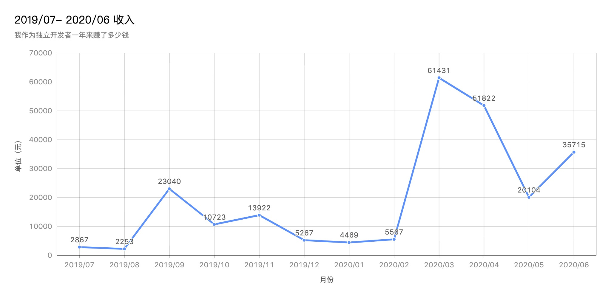
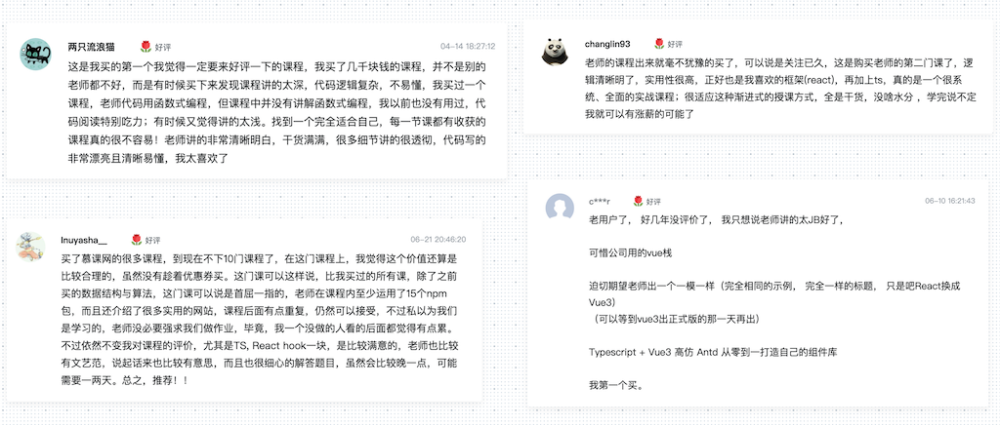

## 挣了多少钱？

一年前我写了一篇独立开发者一个月能挣多少钱的文章，受到了很多朋友的喜欢，
现在时间过去了一年，我一开始只是把它当成兴趣和实验，到现在我把它当作现在和将来的人生目标去完成。所以说这一年来对于我的人生来说来说是最大的蜕变。因为做任何工作都要考虑盈利 Monetization 去赚钱 ，现在独立开发能给我带来一定的收入，所以才觉得可以继续走下去那么我这一年赚了多少钱呢？现在我让大家看看答案，希望能给想做独立开发的朋友做些参考。

我现在的主要盈利的产品来自慕课网的课程，我现在有三套课在卖，这一年中，新上线了两门课。这是我的慕课网首页：[张轩 慕课网精英讲师](https://www.imooc.com/t/6012904/)

那么这就是我卖课的收入的趋势图，也是我一年收入的趋势图，



大家可以观察到这条曲线有两个突然的波峰，然后又慢慢回退到非常稳定。这两个月正式是我新课上线的时间，同时由于第三节课花了很多的心思，所以第一个月的销量还不错。

> 最后的税后收入（和上班最大不同，现在收入都是税后的）是 **237180** 元，减去一些损耗（慕课网的活动折扣，新上线折扣，个人独资企业成本）大约 3 万元，最后大约是 **20 万** 多点左右。

三套课卖的详情我已经以 openSale 的方式公布在我的个人网站上，我所有的课程销售大体金额现在都以图表的方式公布在[这里](/opensale)， 这个收入和我上班的时候还有一些差距，但是它的趋势整体是比较明朗的，随着积累是慢慢不断上涨的。

有一些独立开发者也许会嘲笑我说，你这不就是卖课嘛？说的那么高大上。在我的心目中，独立开发只是一种生活方式，不是做出一个小众 APP 或者独立游戏才算是够酷。我现在的这种方式确实帮我摆脱了朝九晚五的工作，而且我在整个过程中也是完全按照自己的爱好为自己和他人创造了价值，我收获了许多同学真诚的评价，让我感觉有意义。



## 为什么要做独立开发

在之前的[文章](https://zhuanlan.zhihu.com/p/85705608)中就说过，为自己的人生尝试一次 B 计划，为了对抗焦虑，中年危机，也是为了给自己的生活带来更多的变化。

在上家公司，老板和同事是我见过最和善，最开放的人，工作环境舒适，上下班也很弹性，几乎是各种公司里面的翘楚，但是每周一早晨，看到阴沉沉的天空和拥堵成红色的车流，心情还是会本能的降到了谷底，再好的福利，也不能消除定点重复循环工作制度对人性的抹杀，我记得工作的时候，我多次在不同的日期看到一辆同样的车在高架上开过，我会感到恍惚，仿佛那段时间和空间被复制黏贴的一样，我仿佛感觉到了月亮和六便士，以及库彻《青春》两本小说里面主人公的那种被束缚和愤懑的感觉。

独立开发以后，时间你完全自己掌控，可以避开周末的人流在工作日出去玩，反之，周末我也会经常工作，完全看心情，模糊了工作日和双休日的概念。我有一次周一和老婆去看电影《他们已不再变老》，整个大厅就我们两个人。

## 思维转换

之前在公司，作为一个技术人员我想的做多的事情就是我怎样把代码写到最好，为公司产生最大的利润，从而升职加薪。独立开发以后，**我增加了更多产品的思想，用什么技术不重要，重要的是你能使用技术做出什么有价值的产品。**在读了《黑客与画家》这本书后，我深深的觉得一个程序员，其实和画家一样，从事的是创作的工程，它完全不是冷冰冰代码的堆砌，而是把计算机作为画布的一个创作过程。我还记得在 2018年 一个购物网站（具体名称忘记了）卖出了十亿美元，它竟然是使用wordPress 搭建的。 steam（最大的游戏平台）现在仍然在使用 jQuery。所以最重要的是想法，用什么技术只是实现的途径。

所以如果你想做一个程序员，不妨问问你自己是否真的喜欢写代码，喜欢创造，当写代码的时候你是否真的能感受到乐趣。如果你不是这样，仅仅是为了糊口，对于新技术没有任何尝试的欲望，我觉得应该认真考虑一下你是否真的适合这份职业。

## 技术成长

很多人觉得独立开发以后，你自己软件开发的模式就变成了小作坊的模式，技术成长肯定受到限制，我觉得其实不然，在大公司中打工，当你面对的软件很庞大的时候，你可能就变成了一个螺丝钉，在各种小地方修修补补。代码重构变成了一种不切实际的幻想，我在修复 bug 的时候看到一个 if 里面添加了 20多个条件，是由十几个工程师在不同时间提交完成的，都是在修复各种奇怪的bug，每天面对的是这种东西，你觉得提高的上限有多少？那么你自己完成项目有充分的裁量权，而且我在录课的过程中，要确保一些细节没有错误，会查阅大量细节和底层文档，对一些旧的知识有了新的更深刻的认识。有时候一天的收获比在公司一周的还要大。同时我还在顺应潮流不断学习，在这一年中，我用了或者学了 
* Typescript
* React
* Vue
* Electron
* Egg.js
* Tailwind.css
* Gastby.js
* Docker

买了**两台阿里云** 和 **一台 digital ocean** 的机器，自己在家折腾了**树莓派**。

我创建了 **10** 个 repo。

我一共有 **252** 次 commits。

我总共写了 **23473**（当然要去除 node_modules和 package-lock.json 了）行代码。大家可以使用这个好用的命令来统计自己的一个 repo 下的代码数量。

```bash
git ls-files --exclude-standard -- ':!:**/*.[pjs][npv]g' ':!:**/*.ai' ':!:.idea' ':!:**/*.eslintrc' ':!:package-lock.json' | xargs wc -l
```

## 个人品牌 - Personal Branding

那么现在我自己本身就变成了唯一的产品，我每天在想怎么样把自己包装的更好，在有充分的自由时间以后，我发现我现在想做的事情真的挺多的，我会把想做的内容都写在一个 todo list 中，现在越来越多。说说目前在做的事情，其中一些项目现在还不能赚钱，但是人总是要为自己感兴趣的事情付出时间，收获满足，最终还有可能获得财富。

* 在慕课网做课，这个前面就说过了，暂且不提。

* 公众号和[知乎专栏](https://zhuanlan.zhihu.com/c_1021360385940537344) - 《程序员的乌托邦》，这是我写一些文章的地方，我喜欢写文章和大家分享，所以这也是我的产品。 大约经营9个月，公众号有 600+ 关注着，知乎专栏有 900+。

* 视频，除了写作，我还喜欢用更丰富的形式展现我的思想，那么做视频就是一个很好的手段，在整个过程中，学习了怎样剪辑，怎样添加字幕，收获了快乐。我在 B 站主页- [独立开发者 Viking](https://space.bilibili.com/480241067)，还有 [Youtube](https://www.youtube.com/channel/UCm5Z1WsCPhxl_NznRK0tvEw)的主页 - 搜索 程序员乌托邦。

* 还有一些 side project 都在 todo list 上，有些已经完成，有些完成了一半，准备在不久的将来上线。

## 如何开始

有些同学咨询怎样开始独立开发，我的建议很简单，**在工作的时候就想这个问题，在业余时间就开始经营，**比如我在上班的时候第一门课就上线了，一个月大约能带来 2500 元的收入。但是如果你有很大的压力，比如房贷，车贷,有好几个小孩要养，我不建议在没有盈利的情况下就辞职开始，这种生活方式应该是让你尽量缓解压力，而不是让你每天都被压的喘不过气来。

总结就写到这里，新的十年开始，希望自己能做越来越多有意思的事情，遇到越来越多有意思的人。如果大家想和我一起探讨独立开发的生活方式，我建了[telegram](https://t.me/utopiaeof)群大家可以加入随便聊聊。


