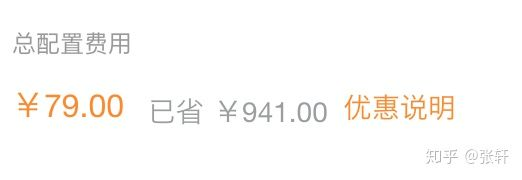
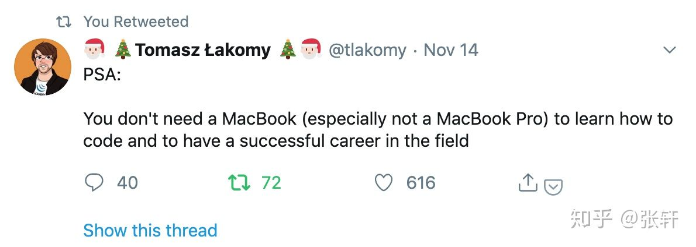

提到极简主义（Minimalism），大家想到的是啥呢？装逼的上层阶级生活概念？一个大房子空无一物，就放个床垫子和一副碗筷吃饭睡觉？抑或是乔布斯老爷子万年不变的高领黑体恤？是受虐苦行僧式的生活？还是一碗灌输给大众的无用鸡汤？

## 起因

光谈概念其实没有任何价值，两年前我发现我在购物上花费的时间不少，我不是一个喜欢囤积和购物的人，但是各种购物信息还是铺天盖地的像我轰炸而来，电梯里面的广告，简单的文案再雇一帮人一阵狂喊。双十一，双十二，618，各种造物节不断的诞生，娱乐节目放着的，厕所小便池上面贴着的，我车的反光镜掖着的，全都是没完没了的广告。这种东西潜移默化的影响了我，我没事也爱逛什么值得买，爱看各种测评，甚至绞尽脑汁想想自己该买些什么，这浪费了我大量的时间和金钱，最后换来了一大堆我根本不需要的东西。

在这期间我看了几个电影，

* [资本主义：一个爱情故事](https://movie.douban.com/subject/3073198/)

* [Maxed out：信贷时代](https://movie.douban.com/subject/2004591/)

* [极简主义：记录生命中的重要事物](https://movie.douban.com/subject/26707099/) 
​

我慢慢的懂得一个道理，不是我自己有问题，而是在资本主义社会中我被异化 **（aIienation）** 了，大家都知道资本主义社会的运作方式是消费，所以它不惜动用一切力量来进行破坏和消费的一种循环，所以现在快消品牌是最火的，（优衣库，HM，Zara 等）它把生产和破坏的周期降到了最短，从2013年至今，H&M在丹麦焚烧了60吨滞销衣物，平均每年12吨，其中有约3万条崭新的儿童和女装牛仔还贴着价格标签就被焚烧。当你没钱消费的时候，它们又提出了信用卡借贷体系，鼓励你提前消费，保持一种大众所认同的生活水平。这就是为什么现在有层出不穷的大学生高利贷，裸贷事件。这就是美国作为全球最富有的国家，无论是个人或者是政府，都深深的陷入了债务危机，难以自拔。

## 解决方案

我意识到了问题，开始寻找解决方案，其实很简单，极简主义绝对不代表抠抠嗖嗖什么东西都不买，而是：不要因为便宜买不需要的东西，不要过度重复购买，卖掉或者送掉不用的东西。

### 减少（断舍离）

我和老婆整理了家里所有不用的东西，全都卖掉，包括她的单反之类的，这种东西说是有用，但是一年她也不会用一次，大到架子鼓，小到新的勺子，全都挂到闲鱼上卖掉，最后结果令我们惊讶，居然卖了 2w 多块钱。

然后是衣服，保持衣橱里面的衣服尽量减少，那些你看到感觉过时了不想穿的衣服，我们全部都捐掉了，我老婆认识一个云南希望工程小学的老师，都捐给了他们，这时候家里的空间变大了，没有那么多的杂物，心里面也很舒服。

### 添加

先晒下成果，今年双十一我没有打开淘宝，啥都没买，唯一买的是一台阿里云 ecs 服务器，太便宜了，忍不住，😄

生活的必需品无非衣食住行这几类，住和行这个可以不考虑，因为谁也不可能天天买房子和汽车。对于程序员来说，一个重点消费对象，当然是数码产品，对于你工作时候要用到的装备，一定要买你在经济承受能力下最好的产品。

**电脑**：做到运行流畅，不卡顿，屏幕不错，我两年前被洗脑成为一个果粉，认为只有买 Macbook pro才行，现在觉得自己是多么幼稚，在推上看到一条，说的非常好

你不需要买一个 Macbook（尤其是 Macbook pro），才能成为一个成功的程序员。

**屏幕，键盘** 都买不错的，因为这两个外设也是你打交道最多的设备，屏幕最好上 4k，眼睛舒服，键盘买你用的舒服的，可以多买两把对比一下，因为用心爱的键盘打字是一种享受。还有最重要的是椅子，程序员坐的时间非常长，投资一把好的椅子很有必要，不过没必要听风就是雨，知乎椅子必谈 herman miller，其实还有很多品牌（steelcase ，我买的hayworth）都不错，而且椅子这种消耗品可以买二手的，我的 hayworth zody 就是二手的，挺舒服的。不过再高级的椅子坐久了不行，最简单的解决方案就是站和坐互换，坐久了出去走一圈。不必拘泥于品牌。手机，我一般都是用坏了再买，对于现在仅仅是在摄像头上不断做文章的新款手机，没有什么购买欲望。

**衣服和鞋子** 方面我相信是大多数人重复购买的大头，我对衣服有一定的追求，讨厌快消品，讨厌优衣库的所谓千篇一律的冷淡风。喜欢粗旷，有一种磨砺感的事物，为了简化购物过程，节省时间，我是这样做的：我把喜欢的衣服品牌放到一个白名单中，T恤，卫衣（vans，champion，superdry），夹克（g-star raw，alpha industries），裤子（g-star raw，dickies），我对球鞋（sneaker） 文化不感冒，鞋子也是喜欢穿的有破旧感的帆布鞋和靴子（vans, converse, timberland)。

白名单建立以后，要买任何类型衣服的时候，就在 amazon 海外购搜索对应分类下面的品牌，这些牌子在海外购比国内便宜太多了，质量也有保证。有了 amazon prime 会员更加便宜。我对自己的要求是相同类型的衣服不能超过两件（T恤是7件），多买的话就把旧的送出去，在这种规则的约束下，从8月到11月底，我仅仅买入了一件 alpha industries 的夹克。

这就是我的做法，这种生活方式带给我的改变就是，我现在很少逛购物网站了，把资源（时间，注意力，金钱，家居空间等等）优先分配给重要的事情或者是给自己带来愉悦的事情，这个事情可以是任何你想做的事情，我可以用来学习技术，做新的课程，做side project，出去散步，和朋友聚会，打游戏。

这就是我作为一个程序员对极简的理解，它不是什么高深的放到哲学书籍里面的大道理，也不是中产阶级编出来的矫揉造作的生活方式，它只是让我感到更开心的生活方式，当然每个人都有自己的生活，如果购物让你感觉很满足很舒服，那也没有任何问题。

