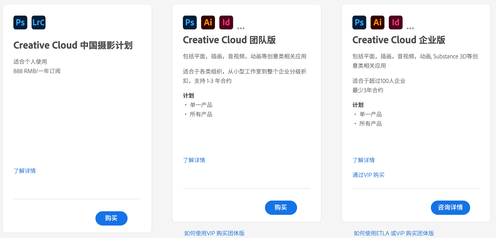
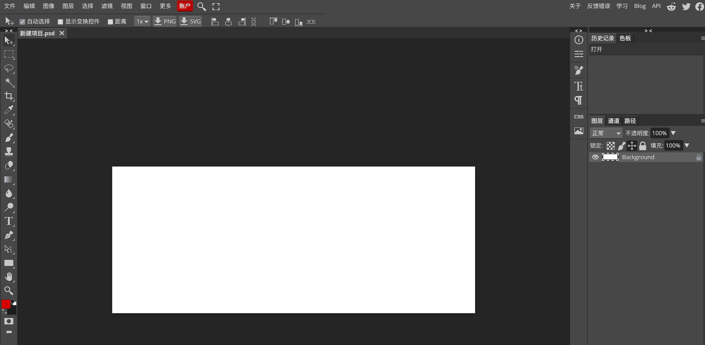
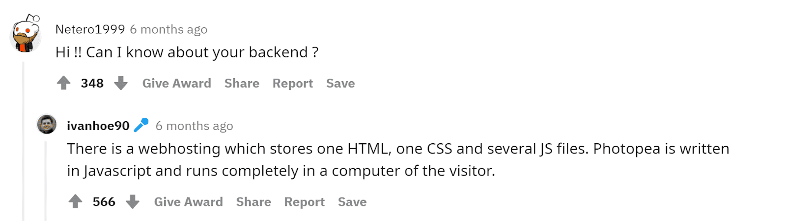
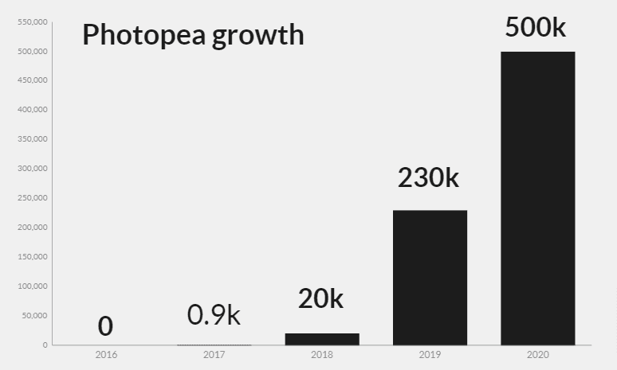
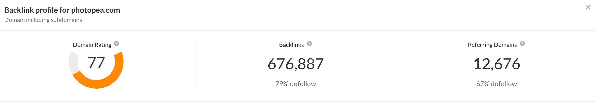

**[在 youtube 观看视频版](https://www.youtube.com/watch?v=jF5Qet80KhQ&t=197s&ab_channel=%E7%A8%8B%E5%BA%8F%E5%91%98%E7%9A%84%E4%B9%8C%E6%89%98%E9%82%A6)**

> 本文参考：
[https://www.indiehackers.com/post/the-story-of-a-unicorn-solo-founder-making-500-000-arr-4c3070f0f0](https://www.indiehackers.com/post/the-story-of-a-unicorn-solo-founder-making-500-000-arr-4c3070f0f0)

> [https://ain.ua/en/2021/04/15/photopea-history/](https://ain.ua/en/2021/04/15/photopea-history/)
[https://zhuanlan.zhihu.com/p/70636726](https://zhuanlan.zhihu.com/p/70636726)

大家好，今天我们来到独立开发赚钱的第三期，讲一个免费软件赚钱的故事，这个产品称之为  Photopea ，这不仅仅是赚钱的故事，这是一个关于程序员坚持自己的梦想的旅程，做大众需要并且喜欢的东西，成功自然而然会来，太多人因为这个时间太长而放弃了自己的产品，但是 Photopea 的作者，一名叫 Ivan Kutskir 的乌克兰程序员坚持了 7 年，到最后他的成功也变成了必然。提到乌克兰，大家能想到的就是美女和战争。谁能想到这个东欧小国还有一段免费软件的佳话。

> 来自乌克兰的 Ivan Kutskir

## 引子 

在开始他的故事之前，我们来说说每个人应该都听说过的大名鼎鼎的 PS - photoshop。它作为图片处理软件中的翘楚，大家应该都或多或少的使用过。但是我相信很多人用的都是盗版，那么正版多少钱呢？2022年初，去官网上很容易找到。

[https://www.adobe.com/cn/creativecloud/buying-plans.html?promoid=4NM89BB1&mv=other](https://www.adobe.com/cn/creativecloud/buying-plans.html?promoid=4NM89BB1&mv=other)

现在它有个花哨的名字，叫 creative cloud。它是一系列 adobe 产品的合集，假如你选购单人套餐，两个产品一年需要 888 元，还是比较贵的。再加上软件比较复杂，安装，打开一个 PSD 文件都要花费大量的时间。

## 开始
将时间拨回到7年前，这个问题同样困扰着来自于乌克兰的 Ivan，他平时会大量使用 Photoshop，他当时设想，是否可以将一个 PSD 文件拖到浏览器当中，让浏览器去解析 PSD 文件呢？他二话没说就开干，他初步创建了一个基于 web 的工具，可以导入一个 PSD 文件，并且将所有的图层解析出来。他当时每天都会迸发很多想法，同时在做 20 个项目。但是一个疯狂的想法这个时候出现了，“为什么不做一个基于 Web 的在线 photoshop，只要有浏览器就可以处理，不用再下载繁琐的工具，那就太棒了！”

> “我知道我在创造一个独一无二的工具，这种感觉驱动我继续前进“。Ivan 在后期的一次采访中如是说。

## 创造以及维护
有了灵感以后，他开始了编码，从最开始简陋的只能支持图层解析，经过6年不断迭代和发展，到现在支持大部分 PS 的工具，比如画笔，图层，滤镜，蒙版等等，如果你去访问 https://www.photopea.com/ 就会看到这样的界面，和 Photoshop 非常相近，如果你去看代码，会发现这个项目没有后端，是纯靠十几万 JS来完成对应的工作。这个网站是完全免费的，而且未来也会一直免费下去。

> Photopea 的使用截图，非常像 Photoshop

> 一个 reddit 的问答
> 网友：“想了解 Photopea 关于后端的配置“
> Ivan：“Photopea 只有一个 html，一个 css 以及几个 js 静态文件组成，功能完全由 Javascript 驱动，在浏览器端运行”

同时在这 7 年的开发维护中，他还开源了一系列处理图片的工具，大家都可以从这里看到 [https://github.com/photopea](https://github.com/photopea) 看一下，对于这么一个由十几万行代码的产品，Ivan 在七年内都是一个人在维护，没有任何一个员工，他开发新功能，修复 bug，写开发博客，在 reddit 上和用户交流意见。他再一次访谈中如是说道：

> I was afraid of their reaction when they would find out it’s only me using an old $500 notebook.
> Later on, I realized I got nothing to hide, and I want to use it as an advantage. I want to show others what they can achieve when they consistently build projects that people want. That’s why I decided to share my story

> 我一开始很害怕当我的用户知道 photopea 是在一台古董级别的 500 美元的笔记本电脑的创造出来的。
> 之后，我反应过来，我没什么可藏着掖着的，我想把这一点作为我的优势，给大家看看，如果你们像我一样，不断的创造和维护用户真正有需求的项目，最终也会获得和我一样的成就。这就是要分享这个故事的原因。

> Ivan 的开发环境，来自文章 https://zhuanlan.zhihu.com/p/70636726

通过这段采访，我们再来看看大佬的开发环境，一张木头桌子，一台老掉牙的 IBM，一个不知名的鼠标，就凭着这些装备，他花了7年时间开发出了一个在线免费的 Photoshop, 这是针对现在程序员对于外设的疯狂追求的一次反击，这些 fancy 的设备和写出好的代码没有任何的关系。

## 受欢迎以及盈利
在线 PS 有着巨大的用户需求，就拿我本人来说，前几天想简单编辑一张图片，但是我又不想下载臃肿的客户端软件，我是一个 web 的信徒，相信一串 URL 代表着稳定的功能和资源。就是这个时候我接触到了 Photopea，并且用它非常方便的修改完了这张图，后来我将这个工具安利给了很多人。
很多人都和我有一样的需求，所以它们到找到了 photopea，2021年3月31日 Ivan 在接受 Indie Hacker 的采访中说，每天有 30万人使用，所有人的使用时间加起来每天有 45000 小时。7 年来，photopea 在的用户在不断惊人的增长。Ivan 一直将它作为免费的产品提供给大家，那么他的盈利是怎样来的呢？

Ivan 是从4 年前才开始盈利的，它主要的盈利途径就是

* 1 广告，借助它巨大的流量，广告给Ivan 带来了丰厚的报酬，当然，它的产品还是以用户为初心的，广告的位置和大小都不会影响用户的使用。
* 2 除了广告，他还提供一些 Photopea 单独的 License 销售，你可以通过特定的 API 将这个工具集成到你的平台中。
* 3 最后，他还支持通过捐赠的形式，让用户升级到高级会员，高级会员的特权就是去除广告。

大家可以看到，photopea 的盈利是逐年上涨的，到 2020年，已经达到了惊人的 50 万美元，同时大家猜猜他的成本是多少？
> Actually, you won’t believe me, but I pay $45 per year.
**45**美元，这太疯狂了，还记得我们之前说的，Photopea只依赖静态文件吗？没有任何数据库和后端程序。只需要付钱 hosts 这些静态文件就好了。

同时，photopea 还没有任何的市场策略，像我这样的用户一样，photopea 的大部分用户都是靠着口口相传，搜索引擎，这种有机的增长。Ivan 只会在不同的社交媒体定期的更新网站的新的功能以及特性。

> Photopea 的 backlinks 数量非常惊人。

## 后记
今天的故事讲到这里结束了，在互联网越来越封闭的今天，在越来越多的产品，绞尽脑汁的增加产品的复杂度，从各种各样的途径给用户挖坑，恶性的传播（拼多多的拉人砍价机制）。我们仿佛忘记了曾经那个一串 URL 代表一个产品，一段资源的世界，Ivan 的故事告诉我们，用心去做可以帮助别人的产品，时间最终会给我们答案，希望每位程序员都像黑客和画家中说的一样，可以像艺术家一样创造自己喜爱的产品。

最后大家可以通过着两个 URL 使用 Photopea。

国际站点：
[https://www.photopea.com/](https://www.photopea.com/)

国内用户访问这个可能会有些慢，还可以选择在国内的镜像：
[https://ps.gaoding.com/](https://ps.gaoding.com/)