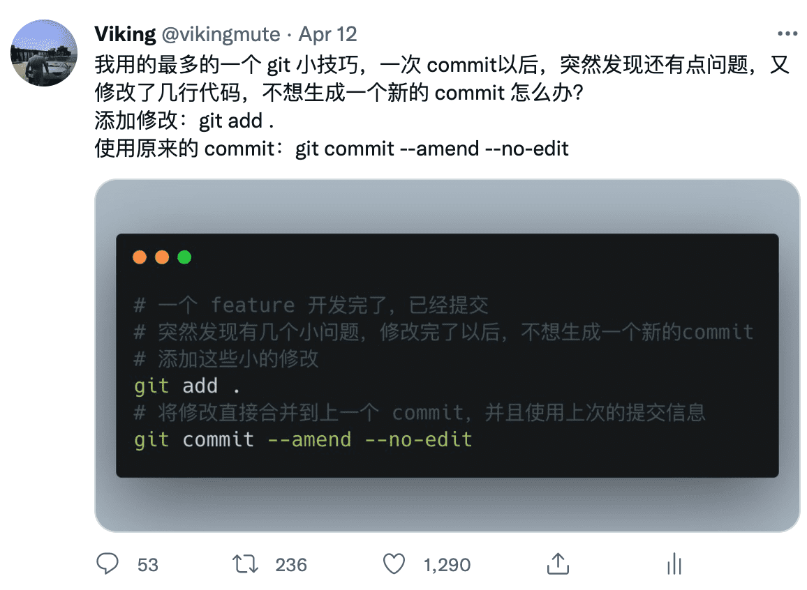

**[在 Youtube 观看视频版本](https://www.youtube.com/watch?v=6Qn18R63M28&feature=youtu.be&ab_channel=%E7%A8%8B%E5%BA%8F%E5%91%98%E7%9A%84%E4%B9%8C%E6%89%98%E9%82%A6)**

大家好，好久不见，上海的疫情比较严重，今天我们不说独立开发者的故事，而是来讲一点技术相关的知识，由于我的受众群体不针对某一个语言或者方向，所以我特意找了一个通用的技术方向，相信大家也看到标题了：六条黄金的 Git 命令。

要做这个专题的来由是我在 twitter 上的一个帖子，引起了很多人的讨论。




发现大家对这个话题都还是很热情的，首先说明几点，第一：我不是什么 git 大牛，我只是通过在工作中对于实际问题的总结得出的最常用的六大命令，只是起到一个抛砖引玉的过程。第二：这不是一个针对初学者学习 git 的初级教程，而是一系列解决实际工作场景的进阶命令。好，现在就让我们开始吧。这里的内容参考来自：[https://ohshitgit.com/](https://ohshitgit.com/) 大家如果有空可以去看一下，非常好的git 技巧网站。

我们本期的视频内容也会发送文字版，想看文字版的可以关注公众号，或者看视频当中的简介, 有对应的链接。

**场景一：第一条**我开发完了一个功能，高高兴兴的提交了代码，但是这个时候我发现有点小问题，比如单词拼写错了。比如运行linter 告诉我少加了一个空格，我不想为了这个小错误添加一个新的 commit。那样显得提交历史特别傻？那么该怎么办呢？

```bash
# 添加这个对应的小的修改
git add .
# 提交并且使用两个特殊的参数
# --amend 修改最新的一次 commit，将现在 staged change 直接添加到上一次 commit 去，不生成新的 commit
# --no-edit amend 的提交不修改提交信息
git commit --amend --no-edit
```
特别注意，假如你的代码已经 push 了的话，要慎用，因为会修改提交历史。
**这里还可以变种出另外的场景**，第二条 比如你发现上次的提交的 commit 有一个 typo，单词拼写错了，处女座的你，必须给他修改一下。

```bash
# 直接运行
git commit --amend
# 在弹出的界面中提交新的信息
```

**场景二：Git 时光机，**有的时候我们特别需要一个时光机器，来记录你的操作步骤，而不是仅仅有你的提交信息，尤其当你clone 下来一个代码库，然后一阵操作，merge 一些 branch，添加删除一些代码，当你发现你误删了东西，弄坏了整个 build 等等，那么你就需要 reflog + reset 这两个命令的组合。

我们来举个例子，比如我现在一阵操作，提交了一个对应的commit，然后又修改了一个文件，现在我发现不行了，我希望倒带到之前的某个提交去。来看看第三条：

```bash
# 显示你的 git 操作记录
# 特别注意它和 git log 的区别，它不仅仅是提交的记录，还有其他git的操作记录
git reflog
# 会看到一系列的操作记录
# 对应的记录号
# 7b6e4f8 HEAD@{0}
# e7d2c90 HEAD@{1} 等等
git reset HEAD@{index}
# 这个时候你就会回到之前的那个状态了
```
这里还有两个参数 --hard，就是啥都不要了，当前已经修改没有提交的文件我也不要了，我就想回到那个操作对应的状态。一下就清净了。
--soft 保留当前的修改回到对应的状态。

**通过这个命令以及上面这两个参数,  可以衍生出其他的操作,**

**比如新的场景** :我想删除最前面的一个或者几个提交，我就可以直接跳转到对应的上次提交的 log，这个时候大家看它我们最前面的提交已经消失了。来看看第四条：

```bash
git reflog

# 7b6e4f8 (HEAD -> master) HEAD@{0}: commit: update test2.txt
# ....
# e7d2c90 HEAD@{13}: commit: add test2.txt
# 找到对应的提交
git reset HEAD@{13}

```


**场景三：Git 后悔药。程序员很长时间都是在和 bug 奋战，而 bug 的来源经常是某次 commit 的提交，有可能是很久以前的，那么想要修改很久之前的一次提交，那么该怎么办呢？**

我们可以通过几种方式来吃后悔药，第一个最传统也是最复杂的方式，就是使用 git rebase -i，rebase 是比较让人蛋疼的命令之一，它的复杂性以及操作性都让新手敢到害怕，比如说我们要修改或者删除之前的一次提交，要使用 rebase 会这样。

```bash
# 先看提交
git log 
# f9f6f3b commit 3
# 2feb45f commit 2
# 07a3cb6 commit 1
# 我们要修改 2 的话，rebase 到它的下一个 commit，这里是 1
git rebase 07a3cb6 -i
# 然后在打开的对话框里面修改，之后还要一个个 rebase continue，非常容易出错
```
现在我给大家来使用一个命令就完成对应的功能，我们希望将某个特定提交中，特定的文件恢复到修改之前的内容。大家平时应该会这么做：在 github 的界面中，看之前版本的提交，然后拷贝到文件当中去。现在我们来用一个命令完成对应的任务，来看看第五条：
```bash
# 先看提交
git log 
# f9f6f3b commit 3
# 2feb45f commit 2
# 07a3cb6 commit 1
# commit2 出问题了，我们要恢复某个文件在 commit 1中的内容，先看看它修改了什么
git show 2feb45f
test.txt
-hello there updated
+hello there deleted
# 可以发现它将 test.txt 从 updated 换成了 deleted，我们希望恢复，使用一条命令
git checkout 07a3cb6[之前提交的hash，也就是 commit1 的hash] -- test.txt[文件的路径]
# 这个时候你就会发现 test.txt 恢复到了 hello there updated
# 🎉 一条命令搞定
```

最后一个场景：我希望删除对应的commit，这次 commit 带来了各种 bug，我想一步清净一下。第六条：

```bash
# 先看提交
# f9f6f3b commit 3
# 2feb45f commit 2
# 07a3cb6 commit 1
# commit2 出问题了，我们要一次性删除掉对应的提交,找到上面第二条对应的 hash 值
git revert 2feb45f[第二条对应的 hash]
# 这个时候它会创建一个新的 commit，并且弹出提交的对话框，修改保存就可以了。
```

好，这就是我总结的六条 git 黄金命令，在工作中它们会经常帮助我渡过各种疑难场景，也希望能帮助到大家，这期节目到这里了，再次强调一下，要看文字版的可以关注公众号，或者看视频里面的链接，谢谢大家，再见。

