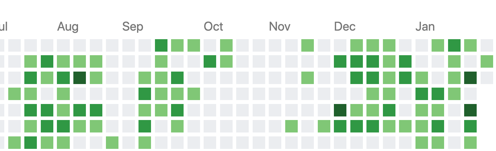

面对日益严重的疫情 很多人都陷入了一阵奇怪的漩涡中，很多人像是笼中困兽一样，在家里呆着太无聊，但是还控制不住自己的双手不断刷疫情的八卦小道消息。这是一个沮丧的死循环。

## 别恐慌

程序员接触信息的途径更多，包括很多境外的信息，最近的信息流爆棚，从起床到睡觉，都一直读不完，小道信息，谣言，八卦，阴谋各种信息都是甚嚣尘上。有的人义愤填膺，有的人吃瓜看戏，有的人觉得是世界末日。其实大家可以问自己一个问题，在你身边，这个病真的有那么糟吗？除了疫区湖北，我觉得大家都是很难认识一个身边的人是患病的，所以做好科学防治，然后安心生活就好，聊斋中有个故事叫《画壁》，蒲松龄最后是这么写的：**“异史氏曰：“幻由人作，此言类有道者。人有淫心，是生亵境；人有亵心，是生怖境。菩萨点化愚蒙，千幻并作。皆人心所自动耳。”** 它的意思就是说所有的场景都是人心所产生的，所以那些各种来源的信息，我们需要少看，学会甄别，多做自己的事情，打游戏也比一直刷这些新闻要好得多。

## 写代码

面对无聊最重要的事情就是做自己喜欢的事情，之前在公司，作为一个技术人员我想的做多的事情就是我怎样把代码写到最好，为公司产生最大的利润，从而升职加薪。独立开发以后，我增加了更多产品的思想，用什么技术不重要，重要的是你能使用技术做出什么有价值的产品，在读了《黑客与画家》这本书后，我深深的觉得一个程序员，其实和画家一样，从事的是创作的工程，它完全不是冷冰冰代码的堆砌，而是把计算机作为画布的一个创作过程。

所以作为一个程序员，你应该是热爱创造，热衷于写代码，如果你在这么大块的业余时间，发现自己根本不想做东西，那么你有可能真的不适合这份工作。

这么多空闲时间，你完全可以开始创造自己的第一个 side project。它可以是一个小工具，是你的个人网站，一个开源库等等。其实程序员真正的作品大多都是他们业余时间完成的，在大公司里面打工，很多需求就是修补尾大不掉的产品，它真正变成了磨灭你编程热情的桎梏，只有真正给自己的内心打工，才是自由的。

我自从成为独立开发者以来，发现我已经完全模糊了双休日的概念，你想完成一个产品，你会非常主动的去工作，就像是它在推动你前进。所以这次疫情对我来说，影响几乎是零，每天还保持着一样的作息时间，过年也是在上海，没有回老家。这是我半年以来的 github 提交记录。（11月份在主要是在做课程的筹备和规划），所以我觉得有这样的经验很重要，它让你了解到在家里呆着也是能创造价值的。

这个时候我才明白，其实没有懒惰的人，只有无聊的事情而已。

## B 计划

在离开公司之前，我看过阮一峰的一本书[《未来世界的幸存者》](http://www.ruanyifeng.com/survivor/)，当时给我很大震撼。其中一篇称之为[《你的 B 计划在哪里？》](http://www.ruanyifeng.com/survivor/plan-b/plan-b.html)，强烈建议大家可以读一读。我当时觉得危言耸听。去年网上就开始不断贩卖程序员年老就失业的故事，现在加上疫情，让想换工作的人也更加慌张。

今年年初的这种氛围不禁让人让我又想起了这个话题，大家是否有自己的 plan B。当特定条件让你的工作被迫停摆以后，还是否能有维持生活的能力？

知名 youtube 主 techlead 预测 2020 年的技术指南，他没有像其他视频一样大谈技术和框架，竟然说，2020年会非常火的是 “视频”。我们的生活现在已经大幅度被视频所渗透，随着 5G 技术的普及，看视频会像看文章一样方便。做视频最能产生价值，只要有流量自然就有广告商和粉丝来买单。所以，技术永远是为内容所服务。希望这段话能给你的 B 计划带来新的思考。

阮一峰在文章中这样写到，希望和大家共勉：

> “制定 B 计划的时候，你可以问问自己，如果人生重新开始，你会选择怎样的工作？ 把这个当作 B 计划的起点。很多人也许会从实际出发，想着如果失去现在的工作，就先在家里休息几天，然后设法在另一家公司里面找到一份类似的工作，再在新的岗位上重整旗鼓。这不算B计划，而只是 A 计划的延伸。你最好把 B 计划当成逃离A计划的一个机会，借此追求一种梦想中期望的工作。只有这样，你才有最大的动力，忍受 B 计划的艰苦。

> 一旦有了 B 计划，我建议，最好立刻动手做一些准备。不一定为了真的实施，但至少让它从一个很模糊的设想，变得稍微具体一点。千万不要只是想想而已，人生缺少的就是行动，只有迈出第一步，才有后面的旅程。“

