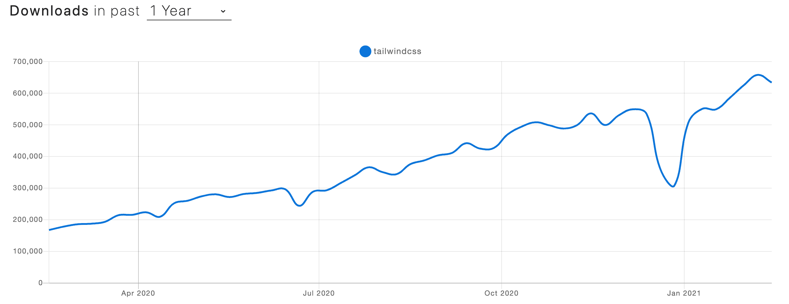

本文改编自：[https://adamwathan.me/tailwindcss-from-side-project-byproduct-to-multi-mullion-dollar-business/](https://adamwathan.me/tailwindcss-from-side-project-byproduct-to-multi-mullion-dollar-business/)   如果感兴趣，可以阅读原文。

**视频版本：[在 Youtube 观看](https://www.youtube.com/watch?v=jJIJQ5JpwM4&t=12s&ab_channel=%E7%A8%8B%E5%BA%8F%E5%91%98%E7%9A%84%E4%B9%8C%E6%89%98%E9%82%A6)**

大家好，好久不见，欢迎大家来到我的频道，今年上半年一直在忙架构师课程的事情，到现在才有时间给大家录点好玩的，今天我们要谈的是开源库怎样赚钱。

对于一个程序员来说，开源库是我们接触也用的最多的一系列内容，开源是程序员共享的一种伟大理念，当然假如你有一个 5k star 的项目，受众人欢迎，每天 npm 下载好几十万，但是你知道怎样将它变现吗？那么今天就来分享一个从个人兴趣项目到年入几百万美元的开源库的故事。

### 首先：搞开源，赚钱很难
首先先上最近的一个新闻，前端人天天使用的 babel ，一个 39K star 的项目，几乎是前端工具链每人都是用的工具，居然发了一篇博客宣称：没钱了。
[https://babeljs.io/blog/2021/05/10/funding-update](https://babeljs.io/blog/2021/05/10/funding-update)

文章中称：这个项目由核心成员构成，并且他们以全职在该项目工作，每个月领取工资。由于 babel 处于工具链的环节，被人感知到的场景比较有限，所以没发很好的拉到广告，加上 2020 年新冠，赞助减少，入不敷出，所以号召大家捐钱。
所以说，**搞开源，赚钱很难**。

> Babel 的资金曲线的变化。

### 两种常规变现方式
一般的开源工具，变现有两种方式。

用爱发电❤️，一些出名的开源项目，最多采用的方式，现在在国外的平台，使用最多的是 patreon，它是一个非常知名的面向粉丝的众筹网站。每月付一定的金额，就可以有权限访问一些特殊的内容。这里有一个出色开源项目在 patreon 的列表[https://github.com/uraimo/awesome-software-patreons](https://github.com/uraimo/awesome-software-patreons)。大家可以看到很多熟悉的名称。比如 HomeBrew 和 iTerm2 ，用 mac 的都用过。但是其实这些软件使用 patron 并不是作为众筹平台，因为它们往往不能给订阅者提供什么附加价值，而是完全处于捐赠的目的。

所以用爱发电肯定是赚不了大钱的，比如 HomeBrew（https://www.patreon.com/homebrew） 那么多人用，一个月只有 2500 刀，所以这些工程师都是伟大的人。

打广告，比如在官网上打广告，既然框架用的人多了，那么自然文档看的人多了，有流量就有钱，比如 Vue 的官网。
我们能在这里看到有一大堆密密麻麻的广告，其实也就是赞助商，当然这个其实和刚才用爱发电是类似的。

但是作为这种大型的开源项目，回报也是实在的，官网上很大的一块地方是属于你的。这也算是用另外一种方式的回报了。在 vue 的 patreon 页面，黄金赞助商的描述写的很清楚， 700k 的pv， 50k 的 uv。

这就是现在开源项目盈利的基本方式，主要就是广告和捐赠。那么有没有什么样的方法来赚钱或者变现甚至是发财呢？

### Tailwind.css 的缘起和发展

现在进入正题，来说 Tailwind.css - [https://tailwindcss.com/](https://tailwindcss.com/) ，这个 css 库在2020年火的一塌糊涂，这下载量坐了火箭一样一阵狂冲。从每天不到 20w 狂冲到 接近 70w。

> tailwind.css npm 下载量，图表来自：https://www.npmtrends.com/tailwindcss

但是它的起步就是作者的一个简单的 side project，大家都知道对于 css 库来说，之前 Bootstrap 几乎处于垄断的市场，作者(Adam Wathan)一开始做一个分享 URL 的兴趣项目，本来想使用 Bootstrap4，但是因为 Bootstrap 使用了 sass，而作者更喜欢 less，所以他就自己搞了一个简单的样式库。

当然它这个样式库搞出来一点花，那就是称之为  utility-first ，啥叫 utility-first，就是创建一大堆的 css class，各种 class 都代表一种比较小粒度的样式，小到啥程度呢？连一个颜色都整出一大堆的色号来，切分的稀碎。

这样做的好处：那就是自由度高，不像其他的 css 框架给你预设了一大堆的样式，你可以随便组合里面细粒度的各种类名，而且这些类是精心给你准备的，颜色字体大小正好看，然后能组合出一大堆的风格各异的样式。

> 同样的布局完全不同的界面，图片来自 tailwindcss 官网

> 同样的布局完全不同的界面，图片来自 tailwindcss 官网

也因为 tailwind.css，就诞生了一堆出名的 meme 图，所这其实就是倒退到 10 年写样式的时代了。

>左：不能把HTML 结构搞的乱七八糟的，这样做很难阅读而且不语义化！
>右：各种css类名。。。

回到正题，毫无疑问, 这个兴趣项目没做半年就被扔进垃圾堆了，他又开始搞第二个兴趣项目，不过之前死的项目留下了一个遗产，就是这些样式类，每个新项目他都把这些样式文件拷贝一份作为开始。同时他在搞第二个项目的时候，他还是开始搞起来了直播写代码，以此激励自己好好写项目。

正是这个直播，让一些人看到了他写的样式库，有的老哥还直接留言向他伸手要这些样式代码。

> 一个老哥在 youtube 的留言“请给我整一套你的 Less 样式，看起来很厉害”

在 2017年推出来的时候，当时大家都用的 bootstrap， 整个界面搞得是千篇一律，同质化非常严重，审美疲劳，很多前端开发看到，bootstrap 那个非常有辨识度的 button 就头疼，潮流这种东西，假如是千篇一律的就非常的无聊。比如这非常有特点的导航条，一看就是直接用 bootstrap 模版整出来的网站。

>经典傻大黑粗导航条-非常多的国内山寨网站都使用了 Bootstrap

有更多的工程师联系到了 Adam，希望以这个简单的样式库为蓝本，开源一个有着新的理念的也就是 utility first 的样式库。经过几个月疯狂的 coding，他们上线了 0.1.0 版本

在程序员审美疲劳苦苦追寻第二个选项的时候，这个时候他们看到了 tailwind，程序员需要个性，先不管好不好看，要的是个性，然后发现用它搞出来的东西可以这么美，这么多变。就折服了。越来越多人使用，口口相传，这流行度也自己嗖嗖的往上冲。Adam 被工程师的热情震惊了，也在这个时候宣布，辞职，全职参与 Tailwind.css 的开发，同时成立了 Tailwind Labs。

### 工程师使用 Tailwind.css 困扰

我也在这个时候开始用 Tailwind.css，对于样式，我也是一个喜欢跟风的人，一些小的项目开始拿它试手，但是我在使用过程中慢慢发现有一个问题，它给你高度可定制化的类名，就像给你一堆高质量的食材，但是只有出色的厨师才能将它们完美的组合成一道菜，它的官网只有一些简单的组件，假如你像做出整个网站来说还差的很远。

这时候就有很多人发布自己组合出来的成品，供大家使用，做成一系列的小模块，或者组件。这时候像我这样的开发就可以拿来即用。很多人开始做了一些二次开发的通用模块，给大家使用，很受欢迎。比如 [https://tailblocks.cc/](https://tailblocks.cc/)，它收集了使用 tailwind 写好的各种模块，供开发者选择使用，一键拷贝，很是方便。

### 商机
这时候创始人 Adam 就嗅到了这个商机，我是tailwind.css 的创始人，“没有人比我更懂怎么组合类名”。

他就开始开发官方的 tailwindUI，其实就是网站元素的合集，并在安装一千万次的时候，发布了 tailwindUI的官网，正式开始卖皮肤。[https://tailwindui.com/](https://tailwindui.com/)

大家访问它的官网可以发现，他将场景也切的很碎，几乎涵盖了一个常见网站的所有要素。

> (tailwindUI 的各种场景，非常详细，涵盖一个网站需要的各种元素，注意带锁的是要付费才能使用的)

所有场景的组件总共售价 250刀，解锁所有皮肤。而且可以用于无限项目。

这个时候 tailwind 已经非常火非常火了，安装都一千万多次了，官方组件的推出一下就卖的很疯狂，其实和我一样，不懂美的开发者太多了，250刀在国外很多开发者来说，做UI 花 250刀其实并不贵，加上很多人对这个开源项目的真心喜欢，疯狂的买买买，6个月的收入就达到了惊人的 200万美元。你是不是很难想象靠着卖皮肤能赚这么多钱？

这就是 Tailwind 的故事，从一个有几个mixin 的 less file发展到了几百万美元的生意。看起来是小概率事件，其实还是这个项目从很早就收获了非常多的关注和很多人的喜爱，在这个时候变现就非常容易。作者现在在扩张团队，除了做皮肤之外，又开始做更多的开源项目，比如一个 headlessui components 一个无样式，支持完美可访问性的组件库，可以很轻松的和 Tailwind CSS 组合在一起。

这种从开源项目到扩展的收费项目也是目前开源的一大趋势，其实 bootstrap 在很早的时候就已经开始卖皮肤，也上线了一个 themes: [https://themes.getbootstrap.com/](https://themes.getbootstrap.com/)的网站，不过让第三方公司做模版，自己从中抽成，而 tailwind 是创始者自己写的官方模版，听起来更有诚意。也可以笼络更多开发者的心和付费的意愿。

好，今天的故事就讲到这里，希望能给大家一点关于开源软件盈利的收获，也同时感谢那么多开源软件的创造者，正是他们共同的努力，才造就了现在生机勃勃，百花齐放的计算机领域。

