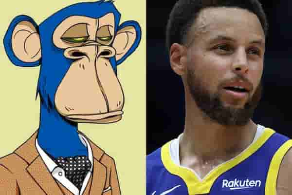
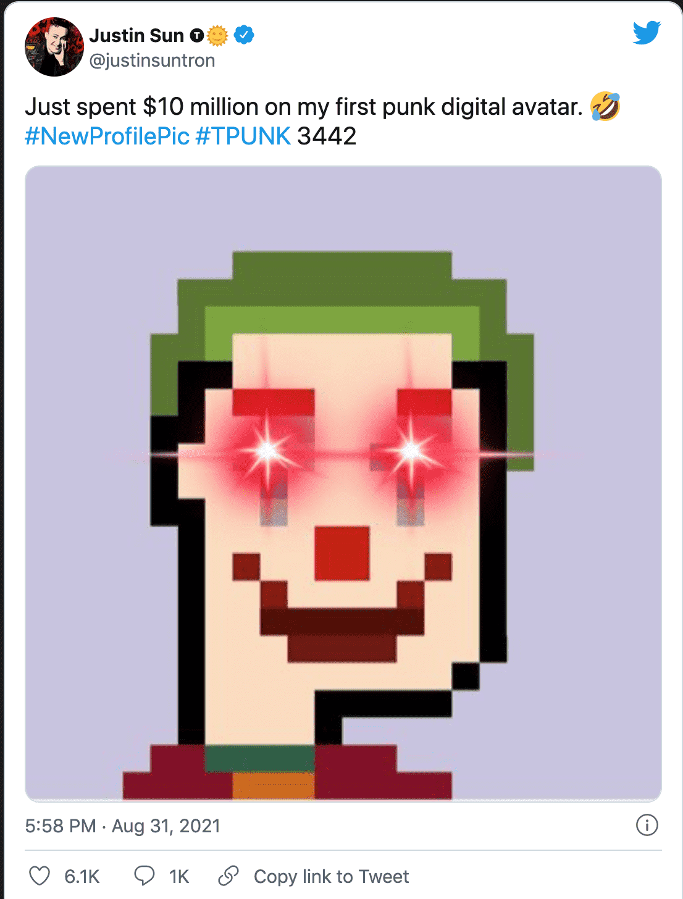
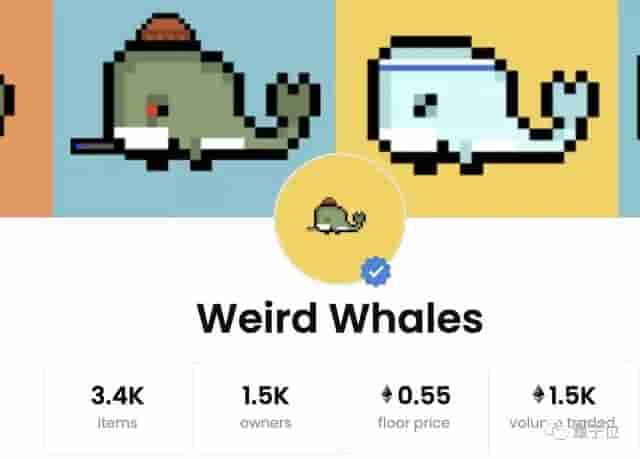
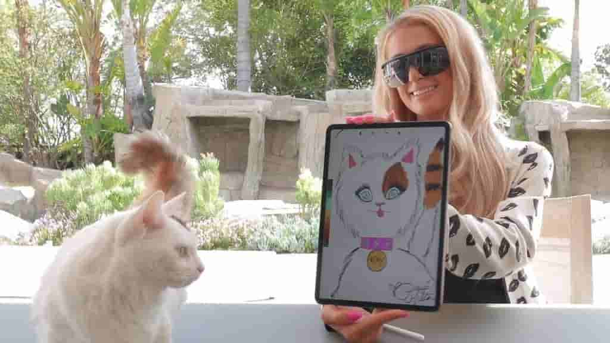
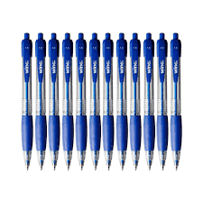
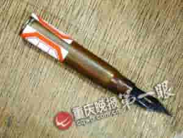
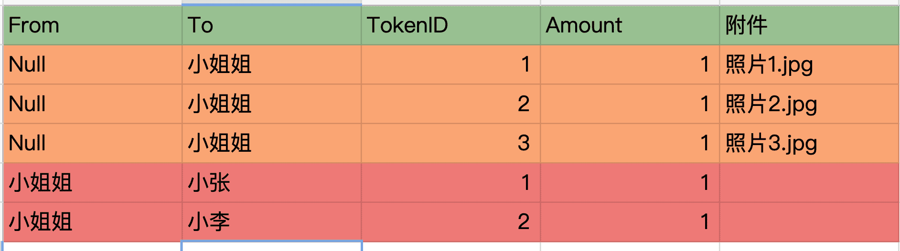
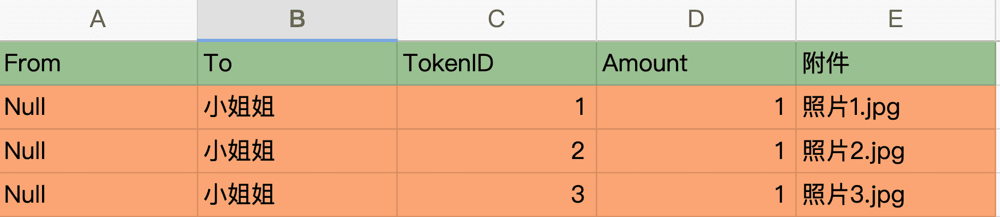
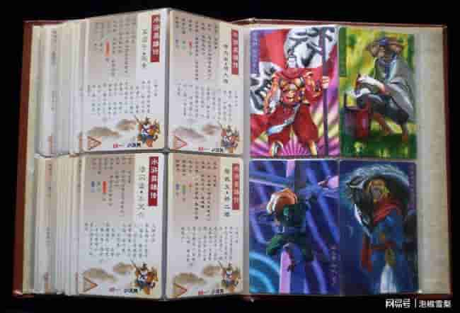
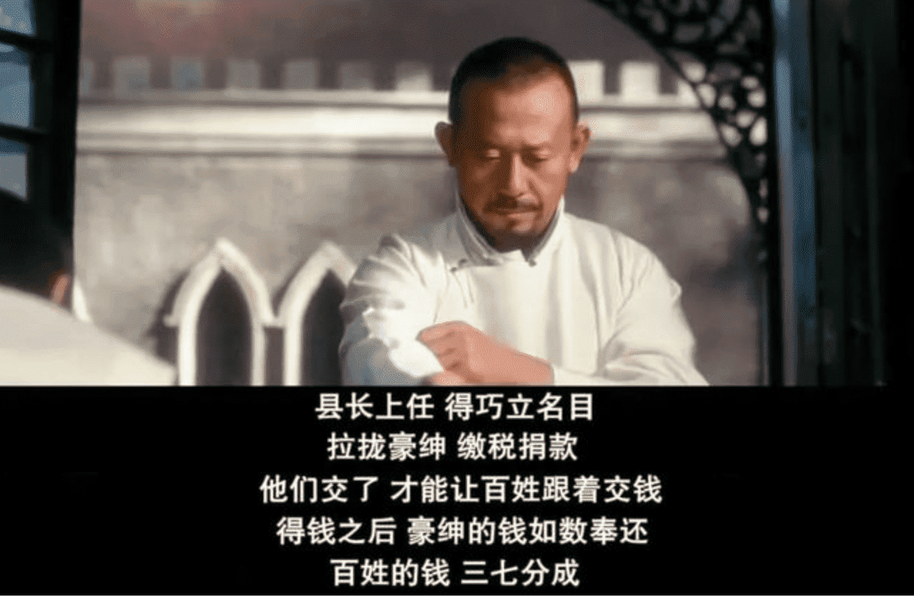

**[点击查看视频版本](https://www.youtube.com/watch?v=5uJflzt3vIg&t=32s&ab_channel=%E7%A8%8B%E5%BA%8F%E5%91%98%E7%9A%84%E4%B9%8C%E6%89%98%E9%82%A6)**

## 前言
今天我们来谈谈 NFT，各位同学们即使你不关注币圈，也应该或多或少从各种新闻 App 的推送中听到了各种各样听起来非常像无稽之谈的新闻。我们先来听点八卦。

Stephen Curry，库里，  NBA 球星，花了18 万美元，买了一个蓝色的卡通猴子头像，这个猴子头像来自于一个称之为 Bored Ape Yacht Club 的猿猴头像系列。这是最近非常流行的一系列猿猴头像，每个猴都有独特的帽子，眼睛，毛色，衣服等等。
[https://hypebeast.com/zh/2021/8/stephen-curry-bored-ape-yacht-club-nft-55-ethereum-purchase](https://hypebeast.com/zh/2021/8/stephen-curry-bored-ape-yacht-club-nft-55-ethereum-purchase)

> 库里的头像

孙宇晨，justin sun，一个貌似臭名昭著的名字，aka 孙哥，花 480万美元拍卖下和巴菲特共进晚餐的那位著名的韭菜收割家。花了 1050 万美元买下了一个像素风的小丑头像。这一系列的头像称之为 joker tpunk。也是Tpunks 头像系列，每个头像都有头发，眼睛，帽子，肤色等等。

[https://watcher.guru/news/justin-sun-tron-founder-buys-joker-tpunk-nft-for-10-5-million](https://watcher.guru/news/justin-sun-tron-founder-buys-joker-tpunk-nft-for-10-5-million)

> 孙割的 twitter，宣布1000万美元拿下一个头像

12岁男孩在暑假里画了一系列画，在区块链上以NFT的形式出售，赚到的虚拟货币价值相当于250万人民币！这些画倒也不是什么精致的艺术品，只是一系列像素风格的鲸鱼。

> Weird Whales 鲸鱼头像合集

美国的明星，歌坛，体育界也天天整 NFT，paris hilton 画猫铸成 nft 卖，林肯公园说唱的那位麦克信田出 NFT，NBA 也出个  将一系Top Shot 列的进球视频集锦做成 nft 卖，还卖的非常火。

> 希尔顿和她画的猫

整个地球仿佛一下快进到了洋葱新闻的世界。魔幻的让人感到不真实。

那么今天的这期的任务就是用猴子都能听懂的语言来讲讲 nft 是什么？怎么玩？ 有没有可能赚钱？
## 什么是NFT？

首先 NFT英文全称为Non-Fungible Token，翻译成中文就是：非同质化代币，具有不可分割、不可替代、独一无二等特点。当然听这个概念和天书一样，等于没说。

简单解释一下，为了搞清楚非同质化代币，先说说它的反义词，同质化代币，法定货币都是同质化货币。例如，一张 100元人民币完全可以和任何其他 100元人民币互换。其他面额也是一样。同理比特币也是同质化货币。

还是有点难理解？没关系，我们再通俗一点，随便扫视一下桌子上的物品，比如说这支笔，假如是同一个型号新的笔，那么不管多少个，都可以从商店里花五块钱买到它，不管哪只，都值五元钱，那么这些笔就是同质化的。

> 五块钱一支的笔

但是假如有一支特定的笔，被某个名人在特定的时期长时间使用过，比如梵高用它画过画，马克思用它写过资本论，那么它就是一只独特的笔，也就是说它就是非同质化的，独特的，它的价值也因此会大大的增加。

> 毛主席用过的钢笔

那么 NFT 就可以对应着一批独一无二的笔，特别注意每一个都是唯一的，即便是在同一系统，NFT 都是单独存在的。并且 NFT 不像 BTC 和 ETH 可以分割为 0.1 或者 0.0002，NFT 的单位永远为 1！

所以NFT 特性：**唯一，不可拆分。这就造就了每个 NFT 都是独一无二的。**

这种特性正和现在社会上的限量版不谋而合，什么发售多少双的球鞋，包包，汽车。而在 nft 这里走到极致，它们是 1：1 或限量版的资产，在以太坊平台上具有流动性和实用性。所以它可以使用这种特性指代现实中的任何的实体和内容。

这里举个例子，我作为一个知名女团明星，听我的经纪人说最近 NFT 很火，而且几乎不需要实体成本，所以我决定作为科技先锋试试水，要发售 100 份极品粉丝限量礼物，比如说私房照片，其实它的实体内容对应的是啥不重要，你可以对应照片，也可以对应一段视频，一段音频，一条微博等等。

> 各种女团明星

这个时候我就会在区块链上先铸造一百个 NFT，铸造这个词听起来太专业了，区块链如果大家还不清楚，我们这里简单理解为分布式数据库，或者云上的 excel 表格，所有人都能访问，这个表格里面是一系列的账本信息，铸造等于在数据库中插入 100 条数据。也就是创建 100 个 token。当然还需要拍一百张私房照，每一张都和一个对应的 NFT 绑定。

> 铸造一百个 NFT，等于插入一百行数据

现在我们的账户中已经有了 100 个NFT，这样数据就准备好了。在下次出通告的时候，我和各位粉丝宣布，作为科技和时尚双料达人，我推出了数字私房照，每张都不一样，限量一百张，先到先得，地板价一万一张，有兴趣的加助理小姐姐微信给你进一步指导。

粉丝们一听这个都痴狂了，才 100个的限量纪念品，眼疾手快的一个姓张的同学，在第一时间画 1w 元买入了一张照片，其实就是在数据库创建一个记录。一个转账记录。

> 小张拿下第一张，小李拿下第二张

现在 001 号照片已经易主，他的新主人是姓张的同学。再次注意 NFT 的本质，他就是一个 token，一串独一无二的标识符，而它上面绑定的商品并不重要。

这个时候张同学拿着这张照片和他班上的各位一阵吹嘘，说看看这限量图片，全球就一张，花一万块钱重金买的。这个时候他班上的一个小弟就拿出手机来说，你这不就是一张图片吗？我在网上刚下载的，和你一模一样。你花一万块钱。是不是傻了啊。

这是大家接触 NFT 的经典问题，我网上可以随便拷贝的图，你为啥要画那么多钱买？和我们刚吃说的一样，每个 NFT 关联的数字产品，你可以随便拷贝多少份，但是这个作品的所有权，或者说是 ownership 是无法篡改的，它安安稳稳的写在我们的数据库当中呢。就像任何人都可以买梵高画作的复制品，两块钱一张，但是真正梵高的作品只有那么一副，价值连城。

回到场景中，这个时候小张同学，笑着说，这叫 NFT，懂不懂，全球独一份，看看我这收藏证书，（NFT 应用可以提供数字收藏证书，证明你买的 token 的合法性）你还下载一张图片，你这啥也不是。

通过这个例子，我想大家应该对 NFT 的大体概念有了一个感知，NFT不可分割、不可替代、独一无二等特点使其在游戏、艺术收藏品的应用上如鱼得水，开启了数字艺术品/收藏品的时代。很多人可能一时无法接受NFT作为艺术收藏品的价值，会质疑凭什么要花几千上万买一张.jpg格式的图片，右键保存免费使用不行吗？

其实要解释这个问题很简单，**不同时代文化载体各不相同，时代红利各自有别，**青铜时代有青铜、铁器、玉器，纸张发明后自然有了书画，改革开放有了股票、房产。而如今数字的时代，文化载体与时代红利必然也有新的方式，这就是历史的进程，只是你身处其中不自知罢了。

回到我小时候，有个经典的水浒卡可以再次解释这个问题，我小学的时候这个东西集这个东西非常疯狂，它是附带在小浣熊干脆面里面的。很多有钱的小孩为了集卡，吃不了那么多面，经常开一包面，把卡拿出来，面直接扔了，这就像是 nft，面就是nft 附带的实体内容，卡是其中的唯一 token，所以面可以直接扔掉，不重要，卡才是有唯一性的王道。

> 水浒卡+卡册，听说一套原版的现在能卖2.6万

## 在哪里能开卖 NFT？
好，我相信通过这个例子，大家都对 NFT 有了一个浅显的认识了。那么假如你是一个出类拔萃的艺术家或者明星，那么你在哪里能卖 NFT 呢？有些网站提供了一揽子服务，比如非常出名的 opensea，[https://opensea.io](https://opensea.io)。我们来浏览一下它的商品。

只要你有一个以太坊钱包地址，然后就可以开始创建你的艺术作品，并且开卖了，具体细节，我就不多说了。几乎是傻瓜式的，如果大家感兴趣，我可以出个教学视频。

> opensea 卖的东西，还是以各种头像占多数

## 郁金香还是未来？
从营销角度上看，NFT的破圈堪称2021最成功案例，不管比特币也好，区块链也好，一定意义上它是一个很好的故事。
故事有个特点，故事真相不重要，最主要的最重要的就是有没有人信，有人信它就会有价值。其实任何的投资市场都是如此，某一个投资人在操作在炒作一个热点。它的炒作是什么？
从初期大家还看不太看不得见，或者说不太理解，或者应该说在质疑声中一路上涨，可能大家差不多都弄清楚了，越来越多的人开始讲同样的故事，讲未来故事的价值，而那个时候的行情大概率也就炒得差不多了。
比如说猴子头像，当库里买了以后你是不是看你的偶像买了就有点心动？
比如孙哥的 1050 万头像，私下里是不是弄两个账号，左手进，右手出呢？没人知道。
当然你也可以趁着浪还没有涨到最高，做一个投机主义者，趁机赚上一笔。
知乎上的一个老哥，这样说：
> “最近一个星期就接了几单老外的NFT的开发订单，$2500一单，简直火到爆棚。其中一个客户上链10天，已经赚了十几个ETH。当然呢，这玩意表面上是艺术，本质就不用说了。要看你怎么炒作吧。看了很多质疑的回复，我只能说的是，你永远赚不到你认知之外的钱。“

最后以让子弹飞里面一段经典的台词结束和大家共勉吧：

 

这是电影让子弹飞中，葛优饰演的师爷和姜文所饰演的刚上任的县长说的，现在都变成了典故或者说是 meme，到处疯传。

>“县长上任，得巧立名目，拉拢豪绅，缴税捐款。他们交了，才能让百姓跟着交钱。得钱之后，豪绅的钱如数奉还。百姓的钱三七分成。 ”